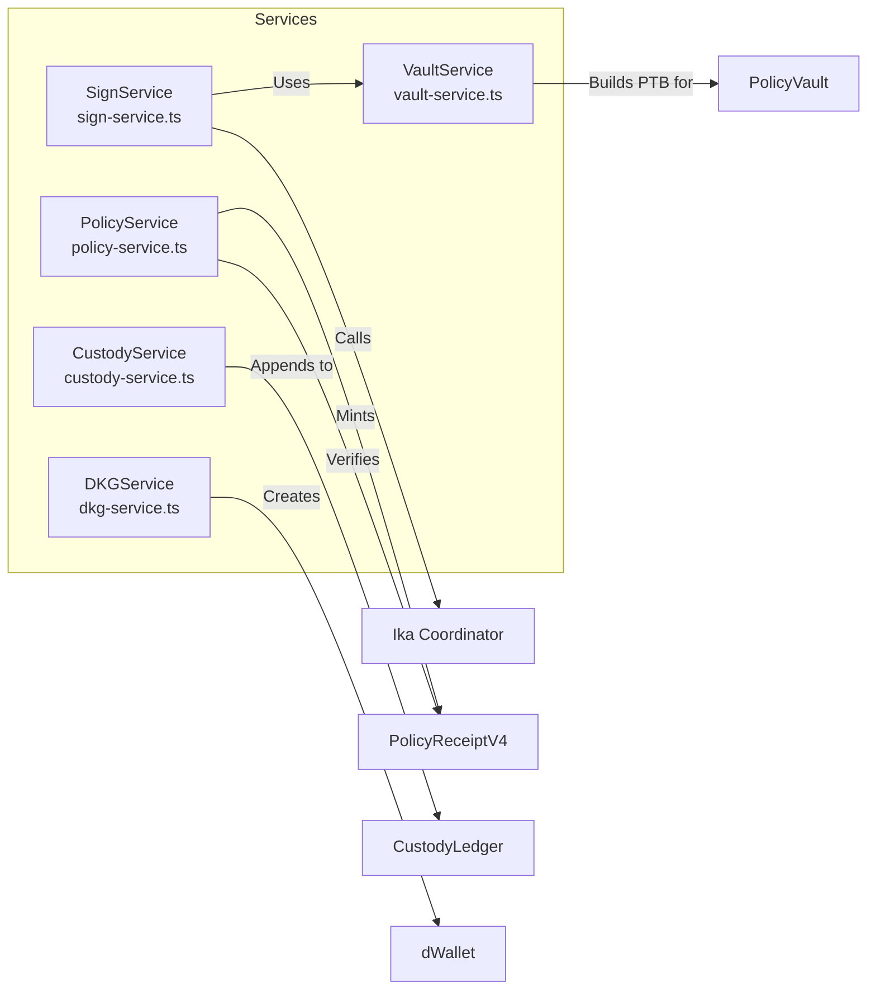
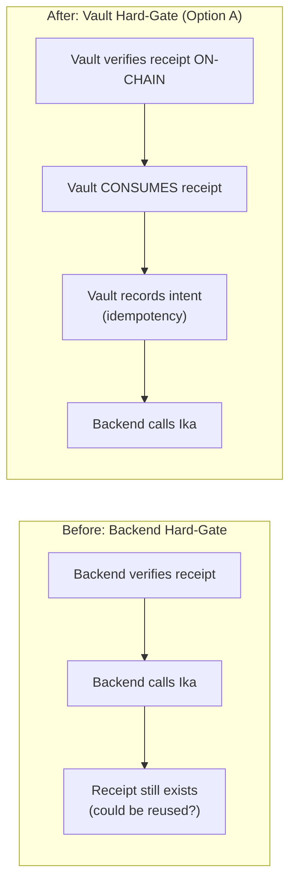
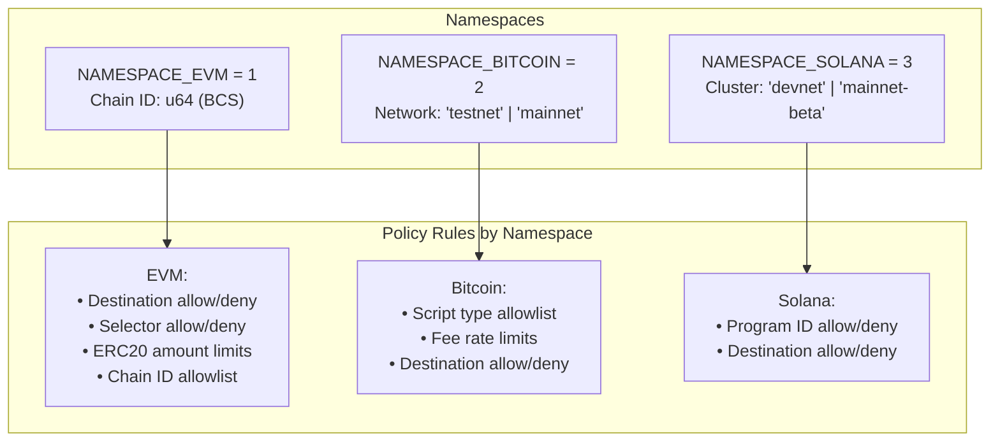

# Kairo Architecture

This document describes the architecture of Kairo, a policy-gated signing system that uses Ika imported-key dWallets with on-chain enforcement via Sui Move smart contracts.

---

## System Overview

Kairo provides non-custodial, policy-enforced signing across multiple blockchains (EVM, Bitcoin, Solana). The system ensures that every signing operation is:

1. **Policy-gated**: A valid `PolicyReceiptV4` must exist proving the transaction complies with on-chain rules
2. **Vault-enforced**: The `PolicyVault` consumes the receipt and authorizes signing on-chain
3. **Auditable**: Every signing action creates immutable custody events on Sui

**System Architecture Diagram:**

```
┌─────────────────────────────────────────────────────────────────────────────┐
│                              USER'S BROWSER                                 │
│  ┌─────────────────────────┐  ┌─────────────────────────┐                   │
│  │   Browser Extension     │  │   WebAuthn/Passkey      │                   │
│  │   (MV3)                 │  │   PRF Encryption        │                   │
│  │                         │  │                         │                   │
│  │   • EIP-1193 provider   │  │   • User share never    │                   │
│  │   • Transaction approval│  │     leaves browser      │                   │
│  └─────────────────────────┘  └─────────────────────────┘                   │
│                           │                        │                        │
│                           └────────────────────────┼────────────────────────┘
│                                                    │
│                        HTTP (localhost:3001)       │
│                                                    ▼
├─────────────────────────────────────────────────────────────────────────────┤
│                              BACKEND (Bun/Elysia)                          │
│  ┌─────────────────────────┐  ┌─────────────────────────┐                   │
│  │   Routes Layer          │  │   Services Layer        │                   │
│  │   /api/sign, /api/policy│  │                         │                   │
│  │   etc.                  │  │   • SignService         │                   │
│  │                         │  │   • VaultService        │                   │
│  │                         │  │   • PolicyService       │                   │
│  │                         │  │   • CustodyService      │                   │
│  └─────────────────────────┘  └─────────────────────────┘                   │
│                                                    │
│                        ┌───────────────────────────┼───────────────────────────┐
│                        │                           │                           │
│                        ▼                           ▼                           ▼
├─────────────────────────────────────────────────────────────────────────────┤
│                              SUI NETWORK                                   │
│  ┌─────────────────────────┐  ┌─────────────────────────┐  ┌──────────────┐ │
│  │   PolicyRegistry        │  │   PolicyVault           │  │   Custody    │ │
│  │   (versions, bindings)  │  │   (enforcement gate)    │  │   Ledger     │ │
│  │                         │  │                         │  │   (events)   │ │
│  └─────────────────────────┘  └─────────────────────────┘  └──────────────┘ │
├─────────────────────────────────────────────────────────────────────────────┤
│                        ┌───────────────────────────┼───────────────────────────┐
│                        │                           │                           │
│                        ▼                           ▼                           ▼
├─────────────────────────────────────────────────────────────────────────────┤
│   IKA MPC NETWORK                  │                   TARGET CHAINS           │
│  ┌─────────────────────────┐       │       ┌─────────────────────────┐       │
│  │   Coordinator           │       │       │   EVM Chains            │       │
│  │   • Threshold signing   │       │       │   (Base, Ethereum, etc.)│       │
│  └─────────────────────────┘       │       └─────────────────────────┘       │
│                                    │                                         │
│  ┌─────────────────────────┐       │       ┌─────────────────────────┐       │
│  │   Network Share         │       │       │   Bitcoin               │       │
│  │   (MPC)                 │       │       │   (testnet/mainnet)     │       │
│  └─────────────────────────┘       │       └─────────────────────────┘       │
│                                    │                                         │
│                                    │       ┌─────────────────────────┐       │
│                                    │       │   Solana                │       │
│                                    │       │   (devnet/mainnet)      │       │
│                                    │       └─────────────────────────┘       │
└─────────────────────────────────────────────────────────────────────────────┘
```

**Data Flow:**
1. User signs request in extension
2. Backend mints PolicyReceipt on Sui
3. PolicyVault authorizes and consumes receipt
4. Ika performs MPC signing
5. Custody event appended to audit trail
6. Signed transaction broadcast to target chain

---

## Component Roles and Responsibilities

### Browser Extension

**Location**: `external/key-spring/browser-extension/src/`

The extension is the user-facing component that manages key material and initiates signing requests.

| Component | File | Responsibility |
|-----------|------|----------------|
| Background Worker | `background.ts` | Intercepts EIP-1193 calls (`eth_sendTransaction`), custom BTC/SOL methods |
| Setup Flow | `setup/` | Passkey creation, key import/generation, dWallet creation, policy publishing |
| Approval UI | `approve/` | Transaction review, policy receipt minting, signature collection |
| Crypto | `crypto.ts` | WebAuthn PRF-based encryption for user share |

**Key Security Property**: The user's secret share is encrypted with a passkey-derived key and **never leaves the browser**. The extension computes `userSignMessage` locally and sends only that to the backend.

### Backend Services

**Location**: `external/key-spring/backend/src/services/`

The backend orchestrates signing operations and enforces policy gates.



| Service | Responsibility |
|---------|----------------|
| `SignService` | Executes MPC signing via Ika; **requires vaultParams** for all signing |
| `VaultService` | Builds vault authorization transactions; checks idempotency |
| `PolicyService` | Mints and verifies PolicyReceiptV4; checks binding/registry constraints |
| `CustodyService` | Appends custody events; enforces custody mode (REQUIRED) |
| `DKGService` | Creates imported-key dWallets via Ika coordinator |

### Sui Move Layer

**Location**: `sui/kairo_policy_engine/sources/`

The Move modules implement on-chain enforcement and audit trails.

| Module | Structs | Purpose |
|--------|---------|---------|
| `policy_registry.move` | `PolicyV4`, `PolicyReceiptV4`, `PolicyRegistry`, `PolicyBinding` | Policy definition, receipt minting, version tracking |
| `dwallet_policy_vault.move` | `PolicyVault`, `VaultedDWallet`, `IntentRecord` | Mandatory signing gate, receipt consumption, idempotency |
| `custody_ledger.move` | `CustodyChain`, `CustodyEvent` | Hash-chained audit trail |

### Ika MPC Network

The Ika network provides threshold signing for dWallets:

- **Coordinator**: Orchestrates DKG and signing sessions
- **Network Share**: Ika holds one share of the 2-of-2 threshold key
- **User Share**: User holds the other share (encrypted in browser)

The combination ensures that neither party alone can sign—both must participate.

---

## Enforcement Boundaries

Understanding where enforcement happens is critical for security analysis:

**Enforcement Boundaries:**

```
┌─────────────────────────────────────────────────────────────┐
│                  EXTENSION (Browser)                        │
├─────────────────────────────────────────────────────────────┤
│ • User approval required for all transactions              │
│ • Passkey authentication for user share decryption         │
│ • Intent hash computation: keccak256(unsignedTx)           │
└─────────────────────┬───────────────────────────────────────┘
                      │
                      ▼
┌─────────────────────────────────────────────────────────────┐
│                   BACKEND (TypeScript)                      │
├─────────────────────────────────────────────────────────────┤
│ • vaultParams REQUIRED (no legacy signing path)            │
│ • Policy verification (receipt fields match request)       │
│ • Custody mode enforcement (REQUIRED)                      │
└─────────────────────┬───────────────────────────────────────┘
                      │
                      ▼
┌─────────────────────────────────────────────────────────────┐
│                ON-CHAIN (Sui Move)                         │
├─────────────────────────────────────────────────────────────┤
│ PolicyVault checks:                                        │
│ • receipt.allowed = true                                   │
│ • receipt matches binding version                          │
│ • intent hash matches                                      │
│ • destination matches                                      │
│ • namespace/chain matches                                  │
│                                                           │
│ • Receipt is CONSUMED (one-time authorization)             │
│ • IntentRecord created (idempotency)                       │
└─────────────────────────────────────────────────────────────┘
```

### What is Enforced Where

| Check | Location | Enforced By |
|-------|----------|-------------|
| User approved transaction | Extension | Approval UI |
| Receipt `allowed = true` | On-chain | PolicyVault |
| Receipt intent hash matches | On-chain | PolicyVault |
| Receipt binding version matches | On-chain | PolicyVault |
| Receipt consumed (one-time) | On-chain | PolicyVault |
| vaultParams provided | Backend | SignService |
| Custody event appended | Backend/On-chain | CustodyService |

---

## Before vs After Vault (Option A)

The system has evolved from a "soft" hard-gate to mandatory vault enforcement:



**Key Differences**:

| Aspect | Before | After (Current) |
|--------|--------|-----------------|
| Enforcement location | Backend only | On-chain (Vault) |
| Receipt lifecycle | Persists after use | Consumed (deleted) |
| Idempotency | None | IntentRecord in Vault |
| Replay protection | Backend logic | On-chain record |

The vault is now **mandatory**—the backend's `SignService` requires `vaultParams` and has no legacy signing path.

---

## Multi-Chain Support

Kairo supports signing across multiple blockchain namespaces:



### Chain ID Encoding

Each namespace encodes chain identifiers differently in receipts and vault authorization:

| Namespace | Chain ID Format | Example |
|-----------|-----------------|---------|
| EVM | BCS u64 (8 bytes LE) | `84532` (Base Sepolia) |
| Bitcoin | UTF-8 string bytes | `"testnet"` |
| Solana | UTF-8 string bytes | `"devnet"` |

### Intent Hash Computation

For vault idempotency and receipt matching, intent hashes are computed as:

```
intent_hash = keccak256(message_bytes)
```

Where `message_bytes` is the unsigned transaction in chain-native format.

---

## Data Flow: Signing a Transaction

**Transaction Flow:**

```
dApp ────► Extension ────► Backend ────► Sui ────► Ika ────► Target Chain
     │          │           │          │          │            │
     │          │           │          │          │            │
1.   │ eth_sendTransaction  │           │          │            │
     │──────────────────────►           │          │            │
     │          │           │          │          │            │
     │          │ 2. Compute intent_hash│          │            │
     │          │    (keccak256)       │          │            │
     │          │           │          │          │            │
     │          │ 3. Show approval UI   │          │            │
     │          │    User approves      │          │            │
     │          │           │          │          │            │
     │          │ 4. Mint PolicyReceipt│          │            │
     │          │──────────────────────►          │            │
     │          │           │          │          │            │
     │          │ receipt_id ◄─────────┼──────────┼────────────┼────
     │          │           │          │          │            │
     │          │ 5. POST /sign        │          │            │
     │          │─────────────────────►          │            │
     │          │           │          │          │            │
     │          │           │ 6. Verify receipt │          │            │
     │          │           │           │          │            │
     │          │           │ 7. Vault authorize│          │            │
     │          │           │───────────────────►          │            │
     │          │           │           │          │            │
     │          │           │ authorization ◄────┼──────────┼────────────┼────
     │          │           │           │          │            │
     │          │           │ 8. MPC sign request│          │            │
     │          │           │────────────────────┼─────────►          │
     │          │           │           │          │            │
     │          │           │ signature ◄─────────┼──────────┼──────────┼────
     │          │           │           │          │            │
     │          │           │ 9. Append custody  │          │            │
     │          │           │───────────────────►          │            │
     │          │           │           │          │            │
     │          │           │ custody_event ◄────┼──────────┼────────────┼────
     │          │           │           │          │            │
     │          │           │ 10. Broadcast tx   │          │            │
     │          │           │────────────────────┼──────────┼────────────┼────
     │          │           │           │          │            │
     │          │           │ tx_hash ◄──────────┼──────────┼────────────┼────
     │          │           │           │          │            │
     │ tx_hash ◄──┼──────────┼──────────┼──────────┼──────────┼────────────┼────
     │          │           │          │          │            │
```

---

## Directory Structure

```
Kairo/
├── sui/kairo_policy_engine/           # Move smart contracts
│   └── sources/
│       ├── policy_registry.move       # Policy, Receipt, Registry, Binding
│       ├── dwallet_policy_vault.move  # Vault enforcement
│       └── custody_ledger.move        # Hash-chained audit trail
│
├── external/key-spring/
│   ├── backend/src/                   # Backend server
│   │   ├── services/
│   │   │   ├── sign-service.ts        # MPC signing orchestration
│   │   │   ├── vault-service.ts       # Vault authorization
│   │   │   ├── policy-service.ts      # Receipt mint/verify
│   │   │   └── custody-service.ts     # Custody enforcement
│   │   ├── routes/                    # API endpoints
│   │   └── chains/                    # BTC/SOL connectors
│   │
│   └── browser-extension/src/         # Browser extension
│       ├── setup/                     # Onboarding flow
│       ├── approve/                   # Transaction approval
│       └── crypto.ts                  # Passkey encryption
│
└── packages/kairo-sdk/src/            # Verification SDK
    ├── suiReceipts.ts                 # Receipt validation
    └── suiCustody.ts                  # Custody verification
```

---

## Security Properties

| Property | How Achieved |
|----------|--------------|
| **Non-custodial** | User share encrypted with passkey, never sent to server |
| **Policy enforcement** | On-chain receipt validation in PolicyVault |
| **One-time authorization** | Receipt consumed (deleted) after vault authorization |
| **Replay protection** | IntentRecord in vault prevents duplicate signing |
| **Audit trail** | Hash-chained CustodyEvents on Sui |
| **Version control** | PolicyBinding ensures explicit policy update approval |

---

## Code References

| Concept | Primary Code Location |
|---------|----------------------|
| Vault authorization | `dwallet_policy_vault.move:policy_gated_authorize_sign_v4` |
| Receipt minting | `policy_registry.move:mint_receipt_v4` |
| Receipt consumption | `policy_registry.move:consume_receipt_v4` |
| Custody append | `custody_ledger.move:append_event_with_receipt_v4` |
| Backend signing | `sign-service.ts:executeSignTransaction` |
| Vault service | `vault-service.ts:authorizeVaultSigning` |
| Policy verification | `policy-service.ts:verifyPolicyReceiptV4` |
