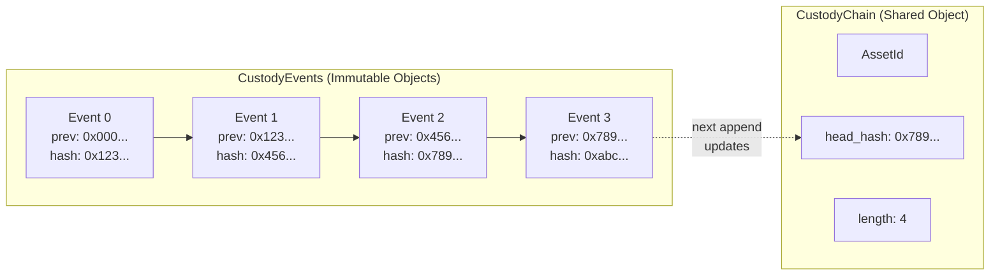
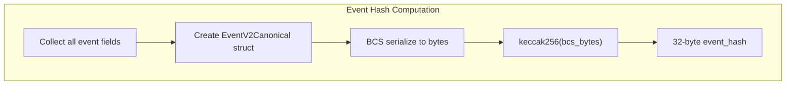
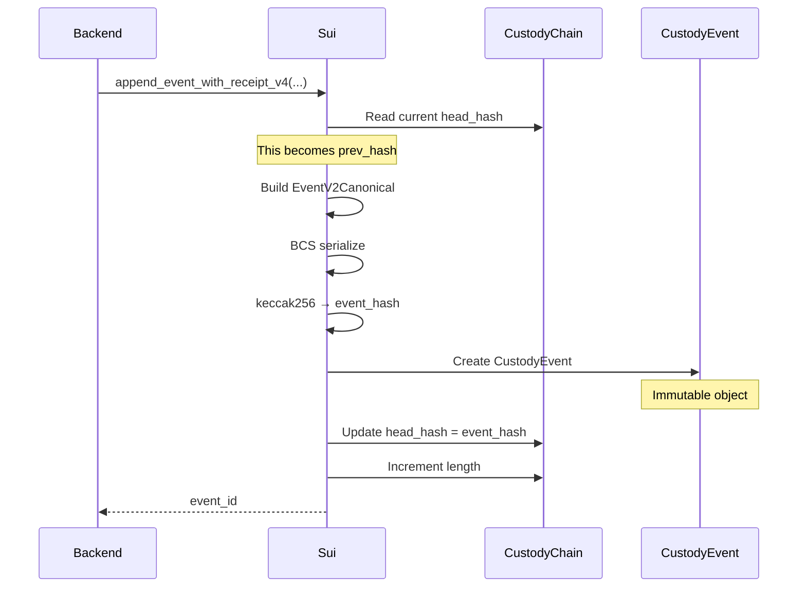
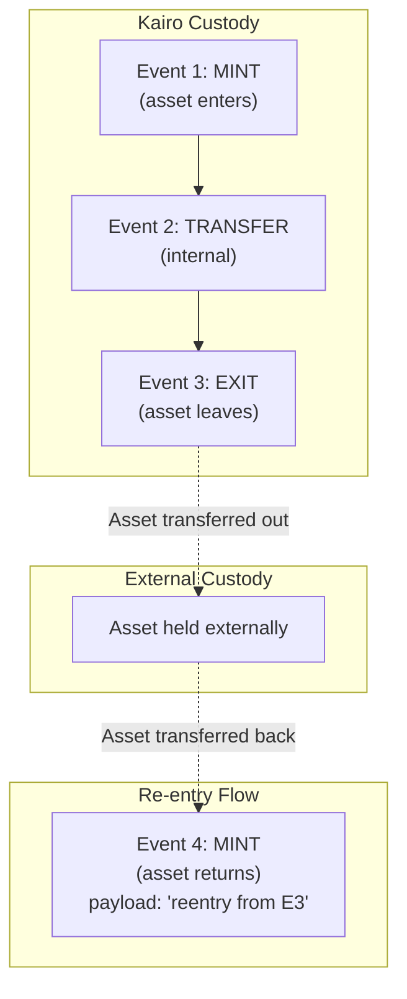
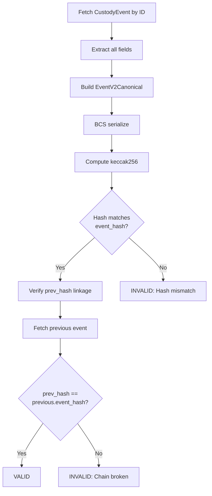
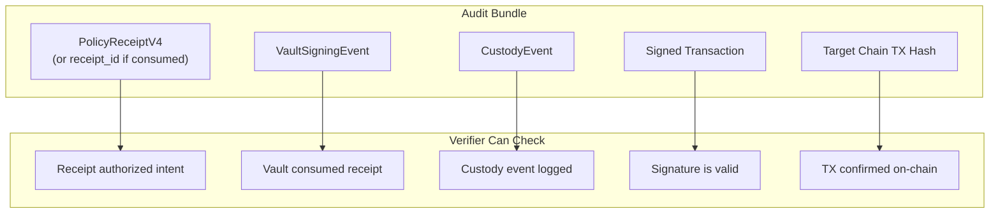

# Custody

This document describes Kairo's chain-of-custody system, which provides an immutable, hash-linked audit trail for all signing operations.

---

## Overview

Every signing operation in Kairo creates a **CustodyEvent** on Sui. These events are:

- **Immutable**: Once created, cannot be modified
- **Hash-linked**: Each event references the previous via `prev_hash`
- **Verifiable**: Event hash can be recomputed from canonical fields
- **Receipt-bound**: Each event references the authorizing PolicyReceipt



---

## Core Structures

### CustodyChain

A shared object that tracks the head of a custody chain for a specific asset:

```move
public struct CustodyChain has key, store {
    id: UID,
    asset: AssetId,
    head_hash: vector<u8>,    // 32 bytes - current chain tip
    length: u64,              // Number of events appended
}

public struct AssetId has copy, drop, store {
    namespace: u8,            // 1=EVM, 2=Bitcoin, 3=Solana
    chain_id: u64,
    kind: u8,                 // Asset type (ERC20, NFT, UTXO, etc.)
    id: vector<u8>,           // Asset identifier
}
```

### CustodyEvent

An immutable object representing a single custody event:

```move
public struct CustodyEvent has key, store {
    id: UID,
    chain_id: object::ID,         // Reference to CustodyChain
    seq: u64,                     // Sequence number (0-based)
    kind: u8,                     // Event type
    recorded_at_ms: u64,          // Timestamp
    
    // Hash chain
    prev_hash: vector<u8>,        // 32 bytes - links to previous
    event_hash: vector<u8>,       // 32 bytes - this event's hash
    
    // Source chain info
    src_namespace: u8,
    src_chain_id: u64,
    src_tx_hash: vector<u8>,      // Transaction hash on source chain
    to_addr: vector<u8>,          // Destination address
    
    // Policy binding
    policy_object_id: object::ID,
    policy_version: vector<u8>,
    intent_hash: vector<u8>,      // 32 bytes
    receipt_object_id: object::ID,
    
    // App-specific data
    payload: vector<u8>,
}
```

---

## Event Types

| Kind | Value | Description |
|------|-------|-------------|
| `EVENT_MINT` | 1 | Asset created/received |
| `EVENT_TRANSFER` | 2 | Asset transferred |
| `EVENT_BURN` | 3 | Asset destroyed |
| `EVENT_LOCK` | 4 | Asset locked (e.g., bridging) |
| `EVENT_UNLOCK` | 5 | Asset unlocked |
| `EVENT_POLICY_CHECKPOINT` | 6 | Policy affirmation recorded |

---

## Hash-Chaining Model

### Chain Initialization

When a chain is created, `head_hash` is initialized to 32 zero bytes:

```move
public fun create_and_share_chain(asset: AssetId, ctx: &mut TxContext): object::ID {
    let mut head = vector::empty<u8>();
    let mut i = 0;
    while (i < 32) {
        vector::push_back(&mut head, 0);
        i = i + 1;
    };
    // head = 0x0000...0000 (32 bytes)
    
    let chain = CustodyChain { id: object::new(ctx), asset, head_hash: head, length: 0 };
    // ...
}
```

### Event Hash Computation (v2/v3)

Event hashes are computed **on-chain** using canonical BCS encoding:

```move
public struct EventV2Canonical has copy, drop, store {
    chain_id: object::ID,
    seq: u64,
    kind: u8,
    recorded_at_ms: u64,
    prev_hash: vector<u8>,
    src_namespace: u8,
    src_chain_id: u64,
    src_tx_hash: vector<u8>,
    to_addr: vector<u8>,
    policy_object_id: object::ID,
    policy_version: vector<u8>,
    intent_hash: vector<u8>,
    receipt_object_id: object::ID,
    payload: vector<u8>,
}

// Compute hash
let canon = EventV2Canonical { ... };
let canon_bytes = bcs::to_bytes(&canon);
let event_hash = hash::keccak256(&canon_bytes);
```



### Append Flow



---

## Logged Fields

Each custody event captures:

| Category | Fields | Purpose |
|----------|--------|---------|
| **Identity** | `chain_id`, `seq` | Which chain and position |
| **Timing** | `recorded_at_ms` | When recorded on Sui |
| **Linkage** | `prev_hash`, `event_hash` | Hash chain integrity |
| **Source** | `src_namespace`, `src_chain_id`, `src_tx_hash` | Where action occurred |
| **Target** | `to_addr` | Destination address |
| **Policy** | `policy_object_id`, `policy_version`, `intent_hash` | Which policy authorized |
| **Receipt** | `receipt_object_id` | Authorizing receipt |
| **App Data** | `payload` | Application-specific context |

---

## Append Functions

### V4 (Generic Rules Receipt)

```move
public fun append_event_with_receipt_v4(
    chain: &mut CustodyChain,
    receipt: &PolicyReceiptV4,
    clock: &Clock,
    kind: u8,
    src_namespace: u8,
    src_chain_id: u64,
    src_tx_hash: vector<u8>,
    to_addr: vector<u8>,
    intent_hash: vector<u8>,
    prev_hash: vector<u8>,
    payload: vector<u8>,
    ctx: &mut TxContext
): object::ID
```

**Checks**:
- `prev_hash` length == 32
- `intent_hash` length == 32
- `to_addr` length <= 64 (supports variable-length Bitcoin addresses)
- `prev_hash` matches chain's `head_hash`
- Receipt's `intent_hash` matches provided `intent_hash`

### V2 (V1 Receipt with on-chain hash)

```move
public fun append_event_with_receipt_v2(
    chain: &mut CustodyChain,
    receipt: &PolicyReceipt,
    // ... similar params
): object::ID
```

### V0 (Legacy - caller provides hash)

```move
public fun append_event_with_receipt(
    chain: &mut CustodyChain,
    receipt: &PolicyReceipt,
    // ... params including event_hash
): object::ID
```

---

## Exit and Re-entry

### Concept

When assets leave Kairo's custody (e.g., transferred to an external wallet), an "exit" event should be recorded. When assets return, a "re-entry" event links back.



### Current Status

**Exit/re-entry event types are conceptual** - the current code doesn't define explicit `EXIT` or `REENTRY` event kinds. Implementation options:

1. Use `EVENT_TRANSFER` with payload indicating exit
2. Add new event kinds: `EVENT_EXIT` (7), `EVENT_REENTRY` (8)
3. Use `payload` field to encode exit/reentry metadata

---

## Verification

### SDK Helper

The SDK provides `fetchAndVerifyCustodyEvent` for verification:

```typescript
// packages/kairo-sdk/src/suiCustody.ts
export async function fetchAndVerifyCustodyEvent(args: {
  suiRpcUrl: string;
  custodyEventObjectId: string;
}): Promise<{ ok: true } | { ok: false; error: string }>
```

### Verification Steps



### Verification Checklist

| Check | What to Verify |
|-------|----------------|
| **Hash integrity** | Recompute `event_hash` from fields |
| **Chain linkage** | `prev_hash` matches previous event's `event_hash` |
| **Receipt binding** | `receipt_object_id` references valid receipt |
| **Intent match** | `intent_hash` matches expected signing intent |
| **Sequence** | `seq` increments correctly |
| **Timestamp** | `recorded_at_ms` is reasonable |

### Full Chain Verification

To verify an entire chain:

```typescript
async function verifyFullChain(chainId: string): Promise<boolean> {
  // 1. Fetch CustodyChain
  const chain = await fetchChain(chainId);
  
  // 2. Start from first event (seq = 0)
  let expectedPrevHash = ZERO_HASH;  // 32 zero bytes
  
  for (let seq = 0; seq < chain.length; seq++) {
    // 3. Fetch event by chain + seq
    const event = await fetchEventBySeq(chainId, seq);
    
    // 4. Verify prev_hash
    if (event.prev_hash !== expectedPrevHash) {
      return false;  // Chain broken
    }
    
    // 5. Verify event_hash computation
    const computed = computeEventHash(event);
    if (computed !== event.event_hash) {
      return false;  // Hash mismatch
    }
    
    // 6. Update expected prev_hash for next iteration
    expectedPrevHash = event.event_hash;
  }
  
  // 7. Verify chain head matches last event
  return chain.head_hash === expectedPrevHash;
}
```

---

## Custody Modes (Backend)

The backend enforces custody recording for all signing operations. Every transaction signing MUST produce a custody event.

| Mode | Behavior |
|------|----------|
| `REQUIRED` | Default for all signing operations. Append required, fail if custody fails. |
| `BEST_EFFORT` | Local development only. NOT compliant. |
| `DISABLED` | Non-signing operations only (e.g., login message signing) |

```typescript
// custody-service.ts
export enum CustodyMode {
  DISABLED = "disabled",
  BEST_EFFORT = "best_effort",
  REQUIRED = "required",
}
```

### Custody Status

| Status | Meaning |
|--------|---------|
| `disabled` | Custody intentionally skipped |
| `skipped` | Best-effort, no chain available |
| `appended` | Event successfully appended |
| `failed` | Append failed (error in `error` field) |

---

## Audit Bundle

For compliance, custody events can be bundled with receipts and signatures:



---

## Code References

| Function | Location |
|----------|----------|
| `create_and_share_chain` | `custody_ledger.move` |
| `append_event_with_receipt_v4` | `custody_ledger.move` |
| `EventV2Canonical` | `custody_ledger.move` |
| `fetchAndVerifyCustodyEvent` | `packages/kairo-sdk/src/suiCustody.ts` |
| `CustodyService` | `external/key-spring/backend/src/services/custody-service.ts` |
