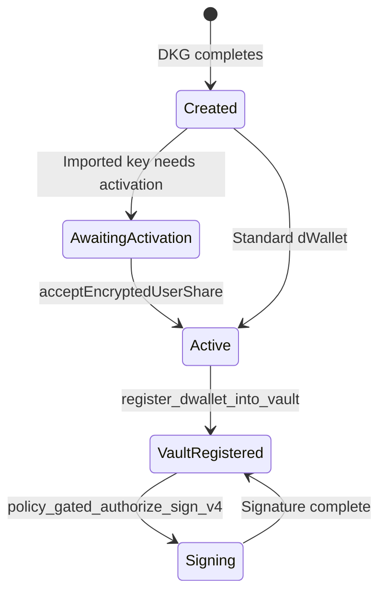
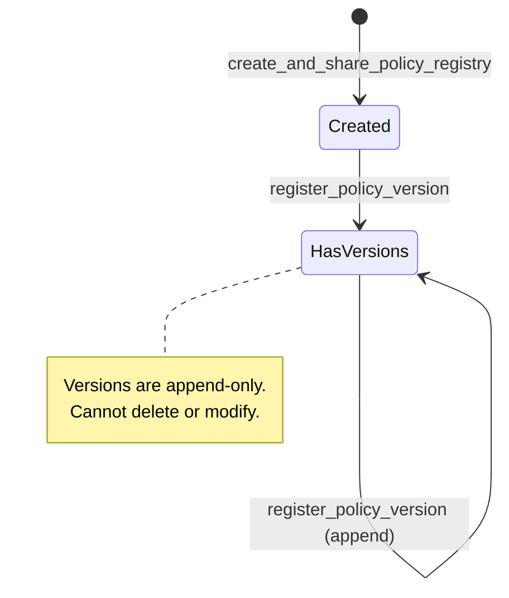
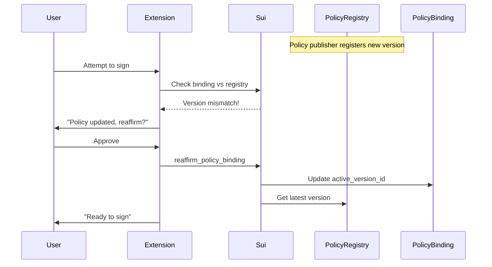
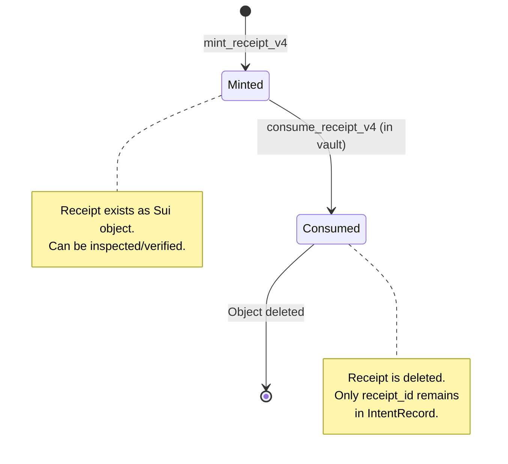
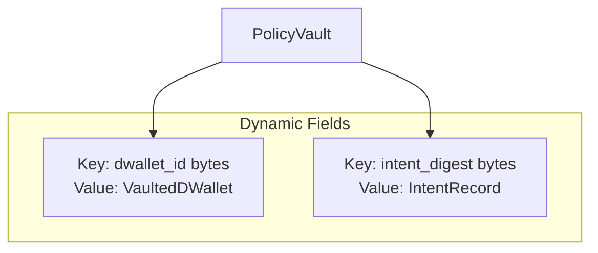

# Data Model

This document defines the core on-chain and off-chain objects used in Kairo's policy-gated signing system.

---

## Object Relationship Overview

**Core Object Relationships:**

```
┌─────────────────────────────────────────────────────────────────┐
│                        DATA MODEL OVERVIEW                       │
├─────────────────────────────────────────────────────────────────┤
│                                                                 │
│  ┌─────────────┐    ┌─────────────┐    ┌─────────────┐           │
│  │   dWallet   │────│PolicyBinding│────│PolicyRegistry│         │
│  │             │    │             │    │              │         │
│  │ • ID id     │    │ • UID id    │    │ • UID id     │         │
│  │ • dwallet_id│    │ • dwallet_id│    │ • series[]   │         │
│  │ • imported_key│  │ • stable_id │    └─────────────┘         │
│  └─────────────┘    │ • active_ver│                            │
│                     └─────────────┘                            │
│                                                                 │
│  ┌─────────────┐    ┌─────────────┐    ┌─────────────┐           │
│  │PolicyVersion│    │   PolicyV4  │────│PolicyReceiptV4│         │
│  │             │    │             │    │              │         │
│  │ • UID id    │    │ • UID id    │    │ • UID id     │         │
│  │ • stable_id │    │ • policy_id │    │ • policy_obj │         │
│  │ • version   │    │ • rules     │    │ • intent_hash│         │
│  │ • policy_root│   └─────────────┘    │ • allowed    │         │
│  └─────────────┘                       └─────────────┘         │
│                                                                 │
│  ┌─────────────┐    ┌─────────────┐    ┌─────────────┐           │
│  │PolicyVault  │────│VaultedDWallet│   │IntentRecord │           │
│  │             │    │             │    │             │           │
│  │ • UID id    │    │ • dwallet_id│    │ • intent_dig│           │
│  │ • mode      │    │ • binding_id│    │ • receipt_id│           │
│  │ • dwallet_cnt│   └─────────────┘    └─────────────┘           │
│  └─────────────┘                                                │
│                                                                 │
│  ┌─────────────┐    ┌─────────────┐                             │
│  │CustodyChain │────│CustodyEvent │                             │
│  │             │    │             │                             │
│  │ • UID id    │    │ • UID id    │                             │
│  │ • asset     │    │ • chain_id  │                             │
│  │ • head_hash │    │ • seq       │                             │
│  │ • length    │    │ • prev_hash │                             │
│  └─────────────┘    │ • event_hash│                             │
│                     │ • intent_hash│                             │
│                     └─────────────┘                             │
└─────────────────────────────────────────────────────────────────┘
```

---

## dWallet

**Purpose**: A distributed wallet created via Ika's imported-key model, enabling threshold signing with a 2-of-2 scheme.

**Location**: Ika network (not a Sui object, but referenced by Sui objects)

### Properties

| Field | Type | Description |
|-------|------|-------------|
| `dwallet_id` | `ID` | Unique identifier on Ika network |
| `dwallet_cap_id` | `ID` | Capability object for signing authorization |
| `is_imported_key` | `bool` | True for imported-key dWallets |
| `encrypted_user_share_id` | `ID` | Reference to encrypted share on Sui |

### Lifecycle



### Relationships

- **PolicyBinding**: Each dWallet has exactly one binding to a policy stable ID
- **PolicyVault**: Must be registered in vault before signing is allowed
- **User Share**: Encrypted with passkey, stored in browser extension

---

## PolicyRegistry

**Purpose**: Shared registry that tracks policy series and their immutable version commitments.

**Location**: `policy_registry.move`

### Struct Definition

```move
public struct PolicyRegistry has key, store {
    id: UID,
    series: vector<PolicySeries>,
}

public struct PolicySeries has copy, drop, store {
    stable_id: vector<u8>,
    versions: vector<object::ID>, // PolicyVersion IDs
}
```

### Properties

| Field | Type | Description |
|-------|------|-------------|
| `id` | `UID` | Sui object ID |
| `series` | `vector<PolicySeries>` | List of policy series, each with versions |

### Key Functions

| Function | Purpose |
|----------|---------|
| `create_and_share_policy_registry` | Creates a new shared registry |
| `register_policy_version` | Adds a new version commitment to a series |
| `get_latest_policy_version_id` | Returns the most recent version ID for a stable ID |

### Lifecycle



---

## PolicyBinding

**Purpose**: Binds a specific dWallet to a policy stable ID and tracks which version the user has explicitly affirmed.

**Location**: `policy_registry.move`

### Struct Definition

```move
public struct PolicyBinding has key, store {
    id: UID,
    dwallet_id: vector<u8>,
    stable_id: vector<u8>,
    active_version_id: object::ID,
    updated_at_ms: u64,
}
```

### Properties

| Field | Type | Description |
|-------|------|-------------|
| `id` | `UID` | Sui object ID |
| `dwallet_id` | `vector<u8>` | The dWallet this binding applies to |
| `stable_id` | `vector<u8>` | Policy stable ID (human-readable identifier) |
| `active_version_id` | `ID` | Currently affirmed PolicyVersion |
| `updated_at_ms` | `u64` | Timestamp of last reaffirmation |

### Key Functions

| Function | Purpose |
|----------|---------|
| `create_and_share_policy_binding` | Creates binding to latest registry version |
| `reaffirm_policy_binding` | Updates binding to latest version |

### Reaffirmation Flow



### Why Bindings Matter

Without bindings, a policy publisher could update rules and immediately affect all users. With bindings:

1. User explicitly affirms a specific version
2. Policy updates require user to reaffirm
3. Vault checks that receipt version matches binding version

---

## PolicyReceiptV4

**Purpose**: Proof that a policy was evaluated for a specific signing intent (V4). Consumed by the vault as one-time authorization.

**Location**: `policy_registry.move`

### Struct Definition

```move
public struct PolicyReceiptV4 has key, store {
    id: UID,
    policy_object_id: object::ID,
    policy_stable_id: vector<u8>,
    policy_version: vector<u8>,
    policy_version_id: object::ID,
    policy_root: vector<u8>,           // 32 bytes keccak hash
    namespace: u8,                      // 1=EVM, 2=BTC, 3=SOL
    chain_id: vector<u8>,
    intent_hash: vector<u8>,           // 32 bytes
    destination: vector<u8>,
    evm_selector: vector<u8>,          // 4 bytes for EVM
    erc20_amount: vector<u8>,          // 32 bytes for EVM
    btc_script_type: u8,
    btc_fee_rate: u64,
    sol_program_ids: vector<vector<u8>>,
    allowed: bool,
    denial_reason: u64,
    minted_at_ms: u64,
}
```

### Properties by Namespace

| Field | EVM | Bitcoin | Solana |
|-------|-----|---------|--------|
| `namespace` | 1 | 2 | 3 |
| `chain_id` | BCS u64 | "testnet"/"mainnet" | "devnet"/"mainnet-beta" |
| `destination` | 20 bytes address | variable (script) | 32 bytes pubkey |
| `evm_selector` | 4 bytes | empty | empty |
| `btc_script_type` | 0 | 0-2 | 0 |
| `sol_program_ids` | empty | empty | list of 32-byte keys |

### Denial Reason Codes

| Code | Meaning |
|------|---------|
| 0 | Allowed |
| 1 | Policy expired |
| 2 | Destination denylisted |
| 3 | Destination not in allowlist |
| 4 | Bad format |
| 10 | Chain ID not allowed |
| 12-13 | Selector deny/allow issues |
| 15 | ERC20 amount exceeded |
| 16 | No policy version in registry |
| 20 | Namespace not allowed |
| 21-22 | Bitcoin script/fee issues |
| 23-24 | Solana program issues |

### Lifecycle



---

## PolicyVault

**Purpose**: Mandatory signing gate that custodies dWallet metadata, enforces policy checks, and provides idempotency.

**Location**: `dwallet_policy_vault.move`

### Struct Definition

```move
public struct PolicyVault has key {
    id: UID,
    enforcement_mode: u8,      // 1=STRICT, 2=EMERGENCY_BYPASS
    dwallet_count: u64,
    created_at_ms: u64,
}

public struct VaultAdminCap has key, store {
    id: UID,
    vault_id: ID,
}
```

### Dynamic Fields

The vault uses dynamic fields to store per-dWallet and per-intent data:



### VaultedDWallet

```move
public struct VaultedDWallet has store {
    dwallet_id: vector<u8>,
    binding_id: ID,
    stable_id: vector<u8>,
    registered_at_ms: u64,
    is_imported_key: bool,
}
```

### IntentRecord (Idempotency)

```move
public struct IntentRecord has store {
    intent_digest: vector<u8>,      // 32 bytes
    sign_request_id: ID,
    receipt_id: ID,
    binding_version_id: ID,
    recorded_at_ms: u64,
}
```

### Enforcement Modes

| Mode | Value | Behavior |
|------|-------|----------|
| `ENFORCEMENT_STRICT` | 1 | Normal operation, all checks enforced |
| `ENFORCEMENT_EMERGENCY_BYPASS` | 2 | Signing disabled (circuit breaker) |

---

## CustodyChain and CustodyEvent

**Purpose**: Append-only, hash-linked audit trail for signing operations.

**Location**: `custody_ledger.move`

### CustodyChain

```move
public struct CustodyChain has key, store {
    id: UID,
    asset: AssetId,
    head_hash: vector<u8>,    // 32 bytes, current chain tip
    length: u64,
}
```

### CustodyEvent

```move
public struct CustodyEvent has key, store {
    id: UID,
    chain_id: object::ID,
    seq: u64,
    kind: u8,
    recorded_at_ms: u64,
    prev_hash: vector<u8>,    // Links to previous event
    event_hash: vector<u8>,   // This event's hash
    src_namespace: u8,
    src_chain_id: u64,
    src_tx_hash: vector<u8>,
    to_addr: vector<u8>,
    policy_object_id: object::ID,
    policy_version: vector<u8>,
    intent_hash: vector<u8>,
    receipt_object_id: object::ID,
    payload: vector<u8>,
}
```

### Hash Chain Structure


### Event Hash Computation (v2/v3)

The event hash is computed on-chain using canonical BCS encoding:

```move
let canon = EventV2Canonical { ... };
let canon_bytes = bcs::to_bytes(&canon);
let event_hash = hash::keccak256(&canon_bytes);
```

This ensures verifiers can recompute the hash from event fields.

---

## Versioning and Compatibility

### Policy Versions

| Version | Features |
|---------|----------|
| PolicyV1 | Basic destination allow/deny |
| PolicyV2 | + Chain allowlist, selectors, ERC20 limits, policy_root |
| PolicyV3 | + Multi-chain (BTC/SOL), namespace rules |
| PolicyV4 | + Generic rules engine, spending ledger, stateful rules |

### Receipt Versions

| Version | Compatibility |
|---------|---------------|
| PolicyReceipt | Legacy, EVM only |
| PolicyReceiptV2 | EVM with extended fields |
| PolicyReceiptV3 | Multi-chain (EVM/BTC/SOL) |
| PolicyReceiptV4 | Multi-chain with generic rules (EVM/BTC/SOL) |

The backend's `PolicyService` handles all versions, using V4 exclusively.

---

## Object Ownership Summary

| Object | Ownership | Mutability |
|--------|-----------|------------|
| PolicyRegistry | Shared | Append-only |
| PolicyVersion | Shared | Immutable |
| PolicyBinding | Shared | Reaffirmable |
| PolicyV4 | Shared | Immutable (per version) |
| PolicyReceiptV4 | Owned → Consumed | Deleted on use |
| PolicyVault | Shared | Mutable (by admin) |
| VaultedDWallet | Dynamic field | Set once |
| IntentRecord | Dynamic field | Sign ID updateable |
| CustodyChain | Shared | Append-only (head) |
| CustodyEvent | Shared | Immutable |
