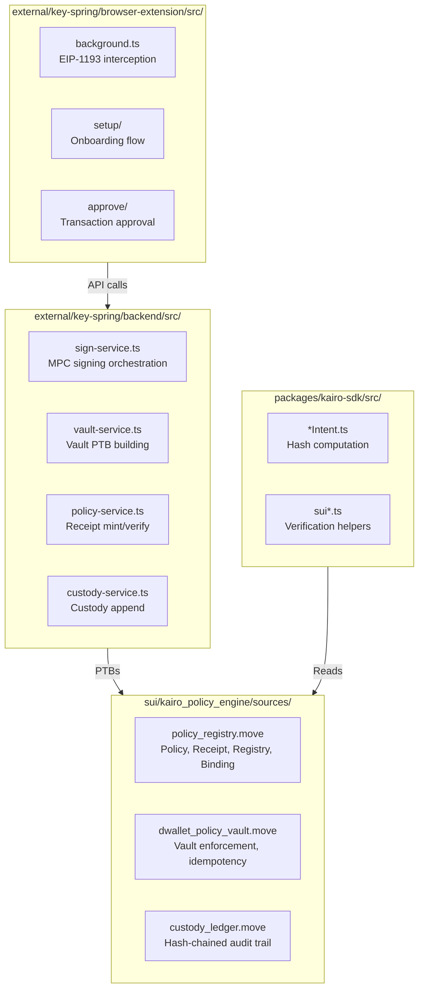
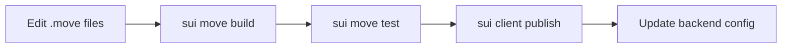
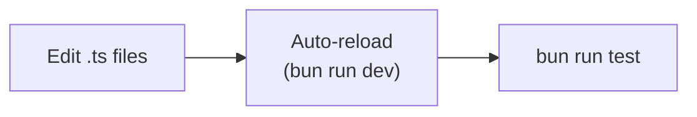
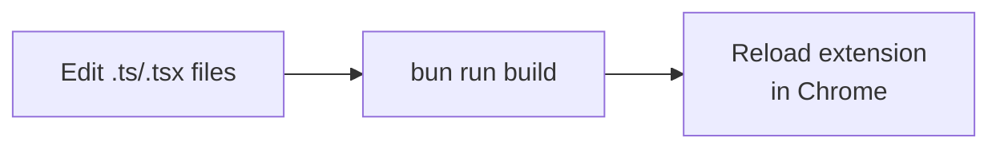

# Developer Onboarding

This document helps developers get started with the Kairo codebase, understand its structure, and run the system locally.

---

## Repository Structure

```
Kairo/
├── sui/                           # Move smart contracts
│   └── kairo_policy_engine/
│       ├── sources/
│       │   ├── policy_registry.move    # Policy, receipts, registry, bindings
│       │   ├── dwallet_policy_vault.move # Vault enforcement
│       │   └── custody_ledger.move     # Chain-of-custody
│       ├── Move.toml
│       └── publish-fresh.ps1           # Deployment script
│
├── external/key-spring/
│   ├── backend/                   # Bun/Elysia backend server
│   │   ├── src/
│   │   │   ├── routes/            # API endpoints
│   │   │   ├── services/          # Business logic
│   │   │   │   ├── sign-service.ts
│   │   │   │   ├── vault-service.ts
│   │   │   │   ├── policy-service.ts
│   │   │   │   └── custody-service.ts
│   │   │   ├── chains/            # BTC/SOL connectors
│   │   │   └── stores/            # In-memory state
│   │   └── package.json
│   │
│   ├── browser-extension/         # Chrome MV3 extension
│   │   ├── src/
│   │   │   ├── background.ts      # Service worker
│   │   │   ├── inpage.ts          # Injected provider
│   │   │   ├── popup.ts           # Config UI
│   │   │   ├── setup/             # Onboarding flow
│   │   │   └── approve/           # Transaction approval
│   │   ├── manifest.json
│   │   └── package.json
│   │
│   └── frontend/                  # Demo Next.js app
│
└── packages/
    └── kairo-sdk/                 # TypeScript SDK
        ├── src/
        │   ├── evmIntent.ts       # EVM intent hash
        │   ├── bitcoinIntent.ts   # Bitcoin intent hash
        │   ├── solanaIntent.ts    # Solana intent hash
        │   ├── suiReceipts.ts     # Receipt verification
        │   ├── suiCustody.ts      # Custody verification
        │   └── suiTxBuilders.ts   # PTB builders
        └── package.json
```

---

## Component Map



---

## Prerequisites

| Tool | Version | Purpose |
|------|---------|---------|
| **Bun** | 1.0+ | JavaScript runtime |
| **Sui CLI** | Latest | Move compilation and deployment |
| **Node.js** | 18+ | Build tools |
| **Chrome** | 116+ | Extension testing |

### Installation

```powershell
# Install Bun (Windows/macOS/Linux)
curl -fsSL https://bun.sh/install | bash

# Install Sui CLI
cargo install --locked --git https://github.com/MystenLabs/sui.git --branch testnet sui

# Verify
bun --version
sui --version
```

---

## Quick Start

### 1. Clone and Install Dependencies

```powershell
cd <your-project-root>

# Backend
cd external/key-spring/backend
bun install

# Extension
cd ../browser-extension
bun install

# SDK
cd ../../../packages/kairo-sdk
bun install
```

### 2. Configure Environment

Create `external/key-spring/backend/.env`:

```env
PORT=3001
SUI_ADMIN_SECRET_KEY=suiprivkey1...    # Your testnet key
SUI_NETWORK=testnet

# Optional: Override package IDs
KAIRO_POLICY_MINT_PACKAGE_ID=0x...
KAIRO_CUSTODY_PACKAGE_ID=0x...
KAIRO_VAULT_OBJECT_ID=0x...
```

### 3. Start Backend

```powershell
cd external/key-spring/backend
bun run dev
```

Backend runs at `http://localhost:3001`

### 4. Build Extension

```powershell
cd external/key-spring/browser-extension
bun run build
```

### 5. Load Extension in Chrome

1. Open `chrome://extensions/`
2. Enable "Developer mode"
3. Click "Load unpacked"
4. Select `external/key-spring/browser-extension/dist/`

---

## Development Workflows

### Working on Move Code



#### Build and Test

```powershell
cd sui/kairo_policy_engine

# Build
sui move build

# Run tests
sui move test

# Test specific module
sui move test --filter policy_registry
```

#### Deploy to Testnet

```powershell
cd sui/kairo_policy_engine

# Use the publish script
.\publish-fresh.ps1

# Or manual publish
sui client publish --gas-budget 100000000
```

After publishing, note the package ID and update `.env`:

```env
KAIRO_POLICY_MINT_PACKAGE_ID=0x<new_package_id>
```

### Working on Backend



#### Development Server

```powershell
cd external/key-spring/backend

# Development with hot reload
bun run dev

# Production mode
bun run start
```

#### Running Tests

```powershell
# Run all tests
bun run test

# Watch mode
bun run test:watch

# Golden tests (snapshot)
bun run test:golden
```

### Working on Extension



#### Development Build

```powershell
cd external/key-spring/browser-extension

# Development build (with watch mode if configured)
bun run dev

# Production build
bun run build
```

After building, reload the extension in Chrome:
1. Go to `chrome://extensions/`
2. Click the refresh icon on the Kairo extension

### Working on SDK

```powershell
cd packages/kairo-sdk

# Build
bun run build

# Test
bun run test
```

---

## Key Code Paths

### Signing Flow

1. **Extension initiates**: `browser-extension/src/background.ts` → `handleEthSendTransaction()`
2. **Approval UI**: `browser-extension/src/approve/` → User reviews and approves
3. **Receipt minting**: `backend/src/services/policy-service.ts` → `mintPolicyReceipt()`
4. **Vault authorization**: `backend/src/services/vault-service.ts` → `authorizeVaultSigning()`
5. **MPC signing**: `backend/src/services/sign-service.ts` → `executeSignTransaction()`
6. **Custody append**: `backend/src/services/custody-service.ts` → `executeCustodyAppend()`

### Setup Flow

1. **Passkey creation**: `browser-extension/src/setup/` → `renderRecovery()`
2. **Key import**: `browser-extension/src/setup/state.ts` → `handleKeyImport()`
3. **dWallet creation**: `backend/src/routes/dkg.ts` → `/api/dkg/create-imported`
4. **Policy creation**: `backend/src/routes/policy.ts` → `/api/policy/create-v3`
5. **Vault registration**: `backend/src/services/vault-service.ts` → `addRegisterDWalletIntoVault()`

---

## Testing

### Unit Tests

```powershell
# Backend unit tests
cd external/key-spring/backend
bun run test

# SDK unit tests
cd packages/kairo-sdk
bun run test
```

### Move Tests

```powershell
cd sui/kairo_policy_engine
sui move test
```

### Integration Testing

1. Start backend: `bun run dev`
2. Load extension in Chrome
3. Open extension popup → Setup
4. Complete onboarding flow
5. Test signing with a dApp

### Manual Testing Checklist

- [ ] Passkey creation works
- [ ] Key import succeeds
- [ ] dWallet created on Ika
- [ ] Policy created on Sui
- [ ] Binding created
- [ ] Vault registration succeeds
- [ ] EVM signing works
- [ ] Receipt minted and consumed
- [ ] Custody event appended
- [ ] Transaction confirmed on target chain

---

## Debugging

### Backend Logs

The backend logs to stdout. Enable verbose logging:

```typescript
// In your service file
console.log("[SignService]", { step: "vault_auth", params });
```

### Extension Debugging

1. Open `chrome://extensions/`
2. Click "Service Worker" under Kairo extension
3. DevTools opens with console and network tabs

### Move Debugging

Use `debug::print` in tests:

```move
#[test]
fun test_something() {
    let value = compute_something();
    std::debug::print(&value);
    assert!(value == expected, 0);
}
```

### Common Issues

| Issue | Cause | Solution |
|-------|-------|----------|
| "vaultParams required" | Missing vault config | Check `KAIRO_VAULT_OBJECT_ID` |
| "E_DWALLET_NOT_FOUND" | dWallet not registered | Call `register_dwallet_into_vault` |
| "E_RECEIPT_NOT_ALLOWED" | Policy denied | Check policy rules |
| Extension not connecting | Wrong backend URL | Check popup config |
| Build fails | Missing deps | Run `bun install` |

---

## Architecture Decisions

### Why Vault-Gated (Option A)?

- **On-chain enforcement**: Policy checks in Move, not just backend
- **Receipt consumption**: One-time authorization prevents replay
- **Auditability**: Every signing leaves verifiable on-chain proof

### Why Hash-Chained Custody?

- **Tamper-evident**: Any modification breaks the chain
- **Verifiable**: External auditors can verify independently
- **Efficient**: O(1) append, O(n) full verification

### Why Imported-Key dWallets?

- **User control**: User holds one share, can't sign alone
- **Non-custodial**: Network can't sign without user
- **Recovery**: User share can be backed up

---

## Resources

### Documentation

- [Sui Move Documentation](https://docs.sui.io/concepts/sui-move-concepts)
- [Ika Documentation](https://docs.ika.xyz)
- [Bun Documentation](https://bun.sh/docs)

### Internal Docs

- `ARCHITECTURE.md` - System overview
- `DATA_MODEL.md` - Core objects
- `FLOWS.md` - Sequence diagrams
- `POLICY_ENGINE.md` - Policy rules
- `POLICY_VAULT.md` - Vault enforcement
- `CUSTODY.md` - Audit trail
- `SECURITY.md` - Threat model
- `INTEGRATION.md` - Partner integration

---

## Scripts Reference

### Root (`package.json`)

| Script | Command | Description |
|--------|---------|-------------|
| `sdk:build` | `cd packages/kairo-sdk && bun run build` | Build SDK |
| `sdk:test` | `cd packages/kairo-sdk && bun run test` | Test SDK |

### Backend (`external/key-spring/backend/package.json`)

| Script | Command | Description |
|--------|---------|-------------|
| `dev` | `bun --watch src/index.ts` | Dev server with hot reload |
| `start` | `bun src/index.ts` | Production server |
| `test` | `bun test` | Run tests |
| `test:watch` | `bun test --watch` | Watch mode |
| `test:golden` | `bun test --golden` | Update snapshots |

### Extension (`external/key-spring/browser-extension/package.json`)

| Script | Command | Description |
|--------|---------|-------------|
| `dev` | `bun run build --watch` | Build with watch |
| `build` | `bun build.ts` | Production build |

### SDK (`packages/kairo-sdk/package.json`)

| Script | Command | Description |
|--------|---------|-------------|
| `build` | `tsc` | Compile TypeScript |
| `test` | `bun test` | Run tests |

---

## Getting Help

1. Check existing documentation in this repo
2. Search codebase for similar patterns
3. Review test files for usage examples
4. Check Sui/Ika documentation for platform specifics
