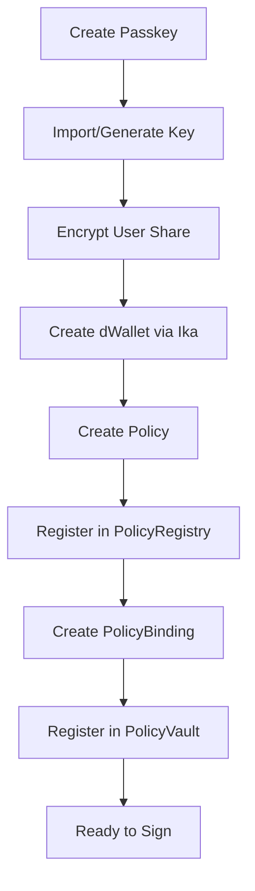
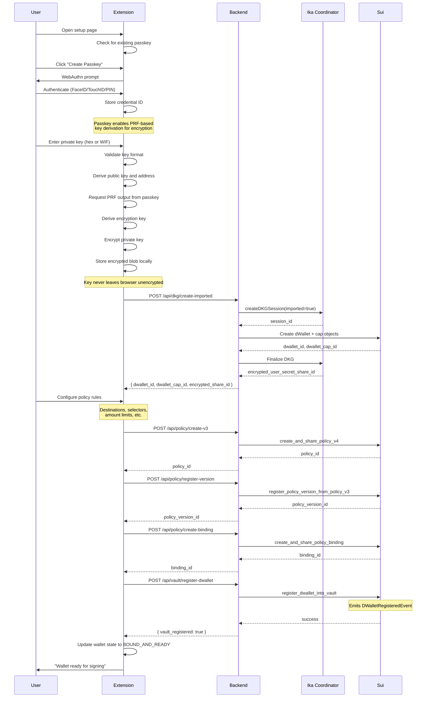
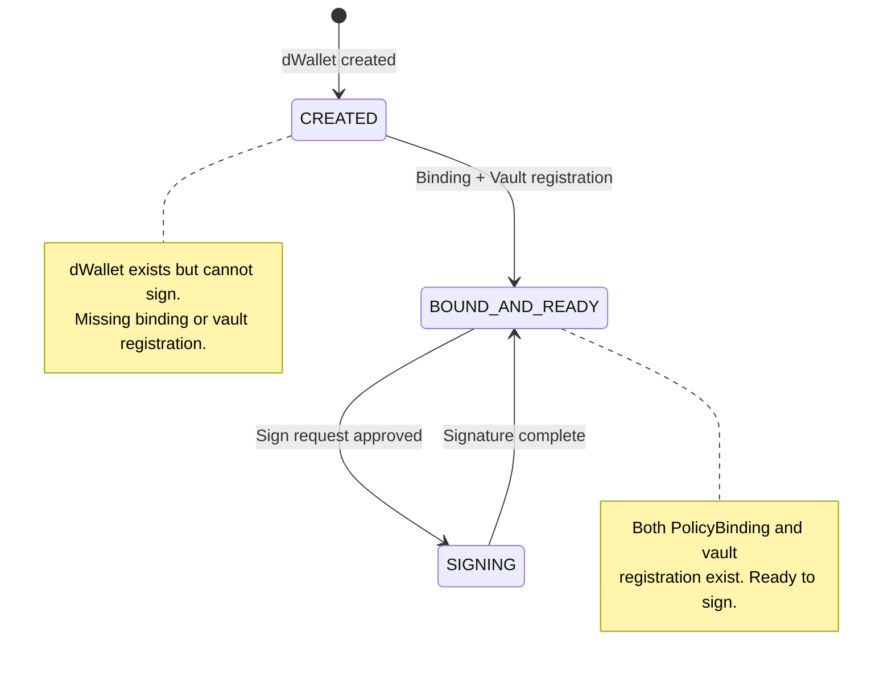
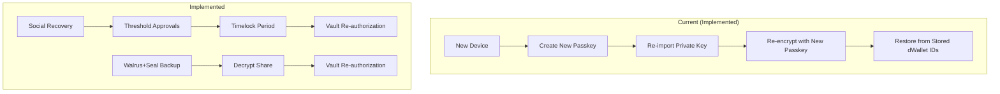
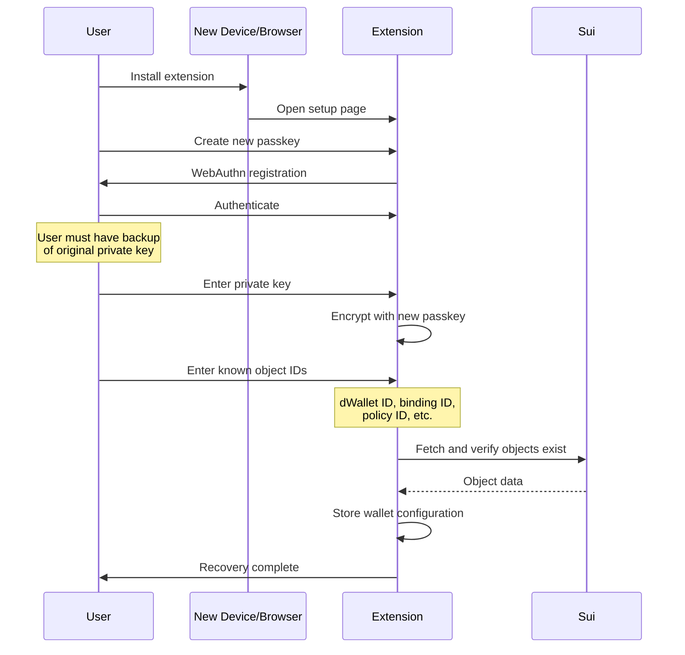
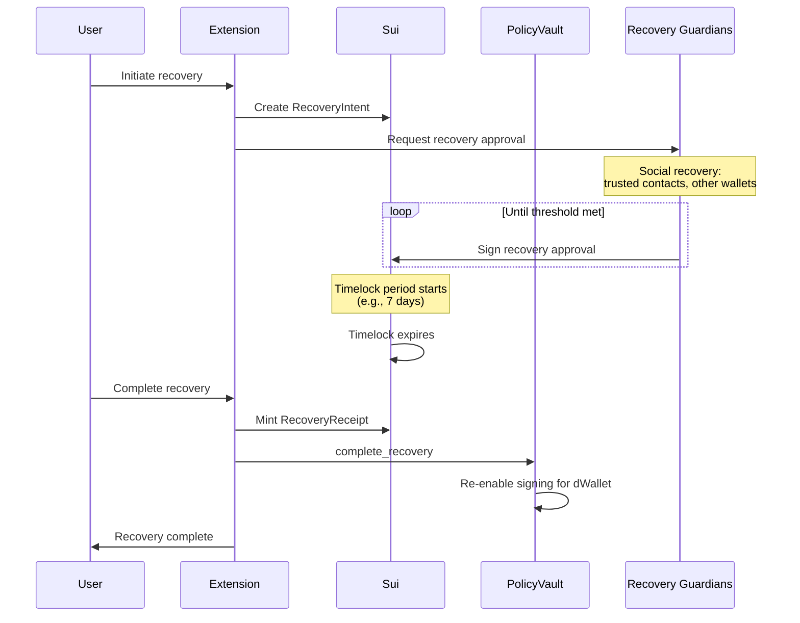
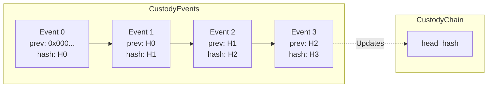
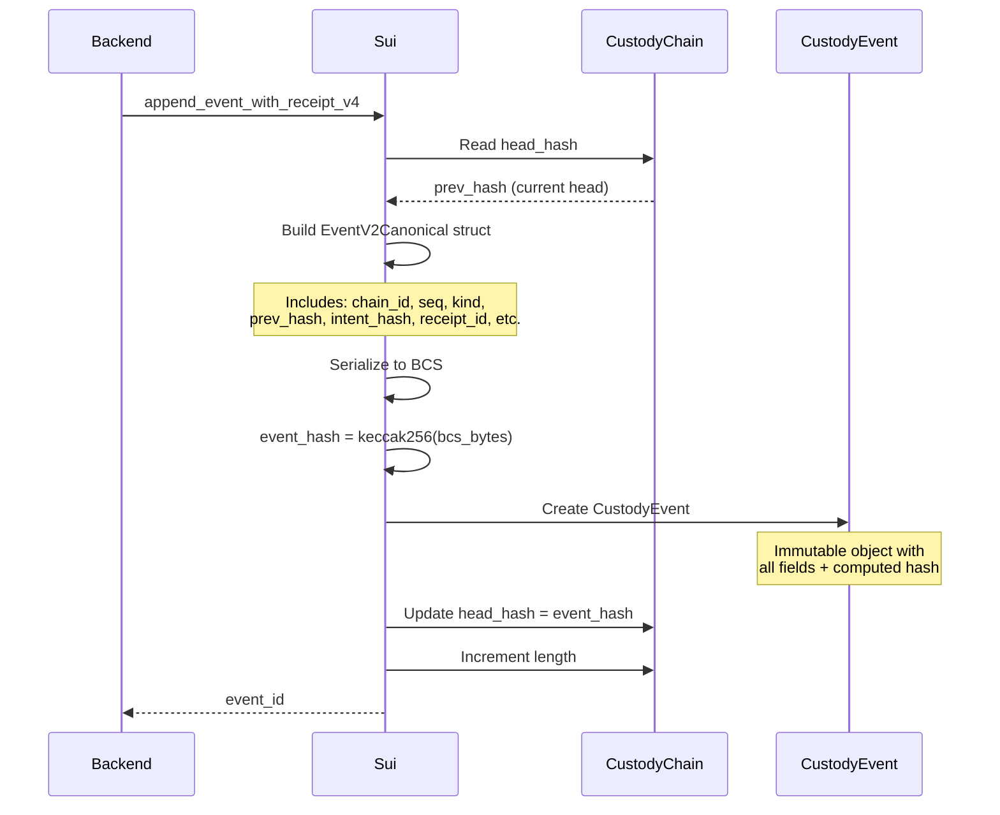
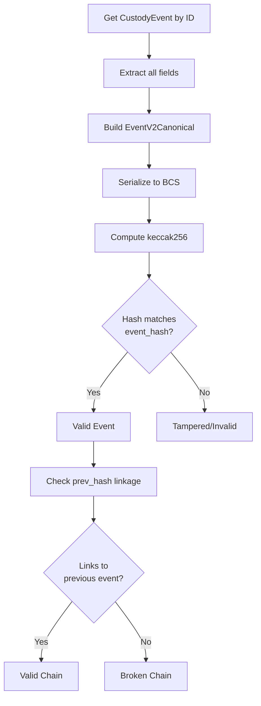
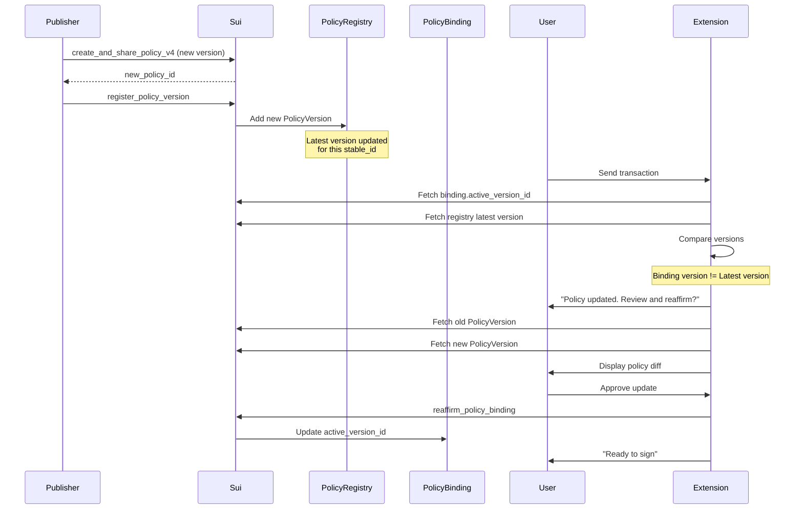

# Flows

This document describes the key operational flows in Kairo with detailed sequence diagrams.

---

## 1. Vault-Gated Signing Flow (Option A)

This is the primary flow for all signing operations. The PolicyVault is the mandatory gate—there is no legacy signing path.

### Overview

**Vault-Gated Signing Overview:**

```
dApp Request → Extension Approval → Mint Receipt → Vault Authorization → MPC Signing → Custody Append → Broadcast → Return tx_hash
```

### Detailed Sequence

**Detailed Vault-Gated Signing Flow:**

```
1. dApp → Extension: eth_sendTransaction(tx)
   └─ Extension intercepts via EIP-1193 provider

2. Extension → Extension: Compute intent_hash = keccak256(unsignedTx)
   └─ Parse transaction, load policy from storage

3. Extension → User: Show approval popup
   └─ User reviews transaction details
   └─ User authenticates with passkey
   └─ Extension decrypts user share locally
   └─ Extension computes userSignMessage

4. Extension → Sui: mint_receipt_v4(policy, intent_hash, destination, ...)
   └─ Sui → Extension: PolicyReceiptV4 { id: receipt_id, allowed: true }

5. Extension → Backend: POST /api/sign/evm
   └─ Includes: receipt_id, intent, userSignMessage, vaultParams

6. Backend → Sui: Fetch receipt object
   └─ Backend validates receipt fields match request
   └─ Backend checks binding version alignment

7. Backend → Sui: policy_gated_authorize_sign_v4
   └─ Vault performs 9 validation checks:
     • enforcement_mode == STRICT
     • intent_digest length == 32 bytes
     • dWallet exists in vault
     • receipt.allowed == true
     • intent_hash matches
     • destination matches
     • chain_id matches
     • namespace matches
     • binding version matches
   └─ Vault consumes receipt (deletes object)
   └─ Vault records IntentRecord for idempotency
   └─ Sui → Backend: SigningAuthorization

8. Backend → Ika: requestImportedKeySign(userSignMessage, presign)
   └─ Ika performs threshold signing (user + network shares)
   └─ Ika → Backend: signature (r, s, v)

9. Backend → Sui: append_event_with_receipt_v4
   └─ Sui appends hash-chained CustodyEvent
   └─ Sui → Backend: CustodyEvent { id, event_hash }

10. Backend → Target Chain: Broadcast signed transaction
    └─ Target Chain → Backend: tx_hash

11. Backend → Extension: { tx_hash, receipt_id, custody_event_id }
    └─ Extension → dApp: tx_hash
```

### Vault Authorization Checks

The vault performs these checks in `policy_gated_authorize_sign_v4`:

| Check | Error Code | Description |
|-------|------------|-------------|
| Enforcement mode | `E_VAULT_EMERGENCY_BYPASS` | Must be STRICT mode |
| Intent digest length | `E_BAD_INTENT_DIGEST_LEN` | Must be 32 bytes |
| dWallet registered | `E_DWALLET_NOT_FOUND` | Must be in vault |
| Receipt allowed | `E_RECEIPT_NOT_ALLOWED` | Must be `allowed=true` |
| Intent hash match | `E_INTENT_HASH_MISMATCH` | Receipt vs request |
| Destination match | `E_DESTINATION_MISMATCH` | Receipt vs request |
| Chain ID match | `E_CHAIN_ID_MISMATCH` | Receipt vs request |
| Namespace match | `E_NAMESPACE_MISMATCH` | Receipt vs request |
| Binding version match | `E_BINDING_VERSION_MISMATCH` | Receipt vs binding |
| Binding stable ID match | `E_BINDING_STABLE_ID_MISMATCH` | Receipt vs binding |
| Binding dWallet match | `E_BINDING_DWALLET_MISMATCH` | Binding vs vault |
| Receipt TTL (optional) | `E_RECEIPT_EXPIRED` | If TTL specified |

---

## 2. dWallet Provisioning Flow

This flow covers the complete onboarding process from key creation to vault registration.

### Overview



### Detailed Sequence



### Wallet State Transitions



---

## 3. Recovery Flow

Recovery involves regaining access to signing capabilities after losing access to the original device or passkey.

### Current Implementation

The current code implements passkey-based recovery:



### Detailed Recovery Sequence (Current)



### Planned Recovery Flow (TBD)



---

## 4. Chain of Custody Flow

Every signing operation creates an immutable custody event, forming a verifiable audit trail.

### Hash Chain Progression



### Custody Append Sequence



### Event Kind Constants

| Kind | Value | Description |
|------|-------|-------------|
| `EVENT_MINT` | 1 | Asset minted/created |
| `EVENT_TRANSFER` | 2 | Asset transferred |
| `EVENT_BURN` | 3 | Asset burned/destroyed |
| `EVENT_LOCK` | 4 | Asset locked |
| `EVENT_UNLOCK` | 5 | Asset unlocked |
| `EVENT_POLICY_CHECKPOINT` | 6 | Policy affirmation |

### Custody Verification



---

## 5. Policy Update Flow

When a policy is updated, users must reaffirm their binding before signing can continue.



---

## Flow Summary Table

| Flow | Trigger | Key Steps | Artifacts Created |
|------|---------|-----------|-------------------|
| **Signing** | dApp transaction | Mint receipt → Vault auth → MPC sign → Custody | Receipt (consumed), IntentRecord, CustodyEvent |
| **Provisioning** | User onboarding | Passkey → dWallet → Policy → Binding → Vault | dWallet, Policy, Binding, VaultedDWallet |
| **Recovery** | Device loss | New passkey → Re-import → Restore | New encrypted share |
| **Custody** | Every signing | Append hash-linked event | CustodyEvent |
| **Policy Update** | Publisher action | Register version → User reaffirms | PolicyVersion, updated Binding |
