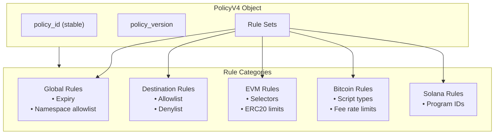
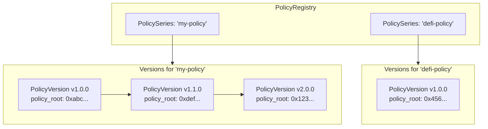
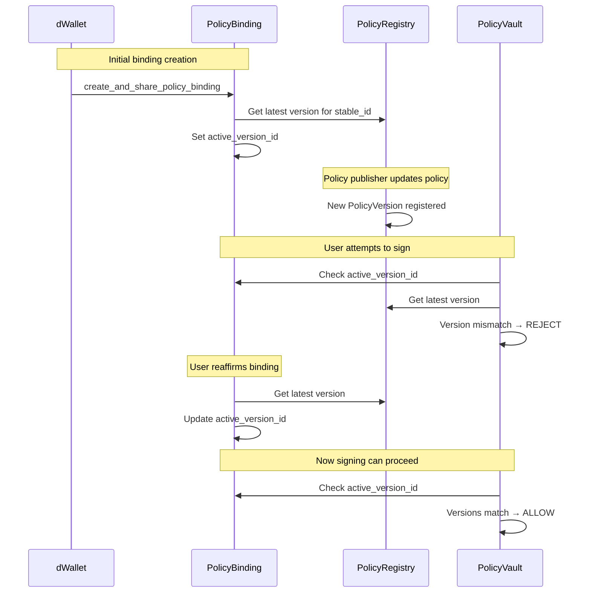
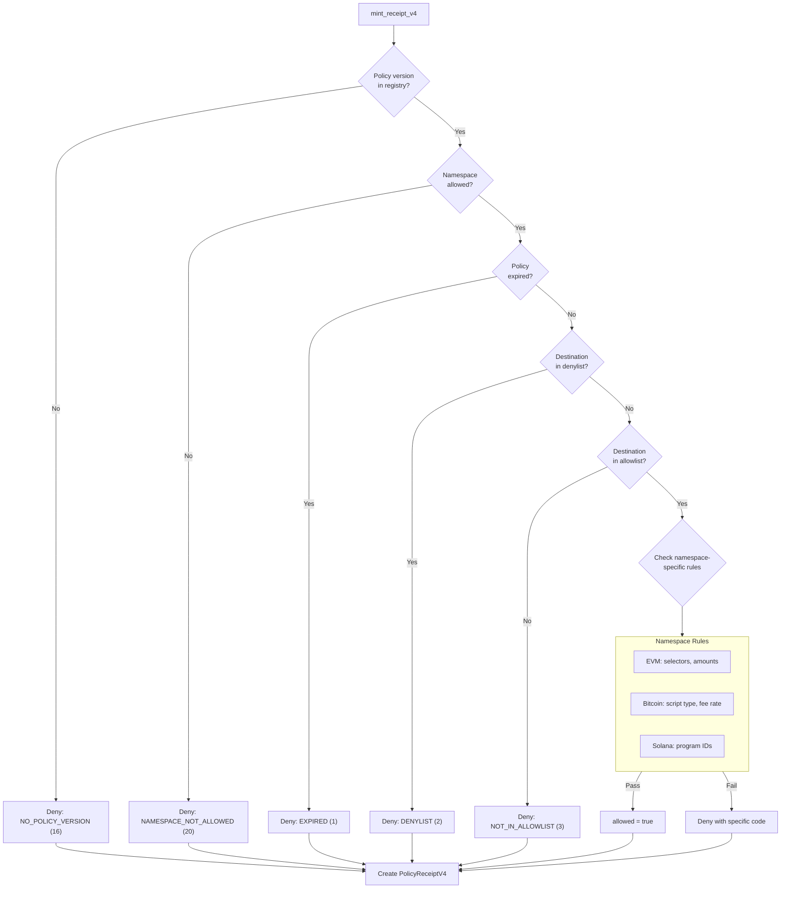
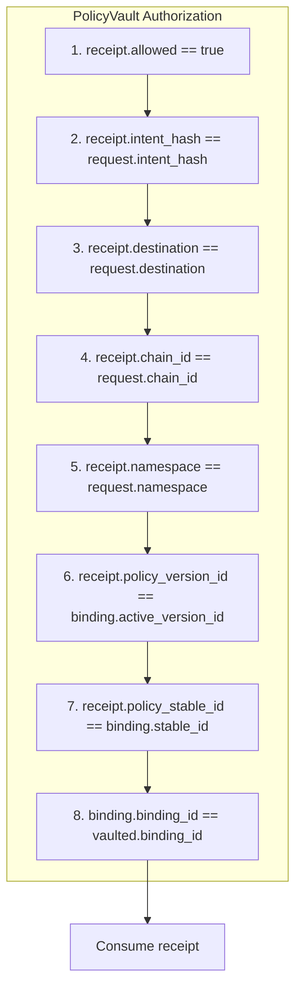

# Policy Engine

This document explains how policies work in Kairo, including policy structure, versioning, receipt minting, and rule evaluation.

---

## What is a Policy?

A **Policy** defines the rules that govern what transactions a dWallet can sign. Policies are:

- **On-chain**: Stored as Sui shared objects
- **Versioned**: Each update creates a new immutable version
- **Committed**: Contents are hashed into a `policy_root` for verification
- **Multi-chain**: Support EVM, Bitcoin, and Solana namespaces



---

## Policy Structure (V4)

The `PolicyV3` struct supports multi-chain policies:

```move
public struct PolicyV3 has key, store {
    id: UID,
    policy_id: vector<u8>,              // Stable identifier
    policy_version: vector<u8>,         // Semantic version
    expires_at_ms: u64,                 // 0 = no expiry

    // Namespace rules
    allow_namespaces: vector<u8>,       // Empty = allow all
    allow_chain_ids: vector<ChainIdV3>,

    // Destination rules (chain-agnostic)
    allow_destinations: vector<vector<u8>>,
    deny_destinations: vector<vector<u8>>,

    // EVM-specific
    evm_allow_selectors: vector<vector<u8>>,  // 4 bytes each
    evm_deny_selectors: vector<vector<u8>>,
    erc20_rules: vector<Erc20Rule>,

    // Bitcoin-specific
    btc_rules: BitcoinRulesV3,

    // Solana-specific
    sol_rules: SolanaRulesV3,
}
```

### Namespace Constants

| Namespace | Value | Chain ID Format |
|-----------|-------|-----------------|
| EVM | 1 | BCS u64 (e.g., 84532 for Base Sepolia) |
| Bitcoin | 2 | String bytes ("mainnet", "testnet", "signet") |
| Solana | 3 | String bytes ("mainnet-beta", "devnet", "testnet") |

---

## Versioning and Policy Roots

### PolicyRegistry

The `PolicyRegistry` tracks all versions of all policies:



### Policy Root Computation

The `policy_root` is a keccak256 hash over canonical BCS-encoded policy fields:

```move
public struct PolicyV3CanonicalV1 has copy, drop, store {
    policy_id: vector<u8>,
    policy_version: vector<u8>,
    expires_at_ms: u64,
    allow_namespaces: vector<u8>,
    allow_destinations: vector<vector<u8>>,
    deny_destinations: vector<vector<u8>>,
    evm_allow_selectors: vector<vector<u8>>,
    evm_deny_selectors: vector<vector<u8>>,
}

public fun compute_policy_root_v3(policy: &PolicyV3): vector<u8> {
    let canon = PolicyV3CanonicalV1 { ... };
    let b = bcs::to_bytes(&canon);
    hash::keccak256(&b)  // Returns 32 bytes
}
```

This allows external verifiers to recompute the root from policy contents.

### Registering a Version

```move
public fun register_policy_version(
    registry: &mut PolicyRegistry,
    clock: &Clock,
    stable_id: vector<u8>,
    version: vector<u8>,
    policy_root: vector<u8>,  // 32 bytes
    note: vector<u8>,
    ctx: &mut TxContext
): object::ID
```

Creates:
- **PolicyVersion**: Immutable commitment to the policy
- **PolicyChange**: Changelog entry with optional note

---

## PolicyBinding

A `PolicyBinding` links a dWallet to a specific policy version, requiring explicit user approval for updates.



### Reaffirmation

```move
public fun reaffirm_policy_binding(
    binding: &mut PolicyBinding,
    registry: &PolicyRegistry,
    clock: &Clock
): object::ID  // Returns new active_version_id
```

---

## PolicyReceiptV4

A receipt proves that a policy was evaluated for a specific signing intent.

### Receipt Structure

```move
public struct PolicyReceiptV4 has key, store {
    id: UID,
    
    // Policy commitment
    policy_object_id: object::ID,
    policy_stable_id: vector<u8>,
    policy_version: vector<u8>,
    policy_version_id: object::ID,
    policy_root: vector<u8>,           // 32 bytes

    // Intent details
    namespace: u8,                      // 1=EVM, 2=BTC, 3=SOL
    chain_id: vector<u8>,
    intent_hash: vector<u8>,           // 32 bytes
    destination: vector<u8>,

    // Namespace-specific fields
    evm_selector: vector<u8>,          // 4 bytes
    erc20_amount: vector<u8>,          // 32 bytes
    btc_script_type: u8,
    btc_fee_rate: u64,
    sol_program_ids: vector<vector<u8>>,

    // Result
    allowed: bool,
    denial_reason: u64,
    minted_at_ms: u64,
}
```

### Minting Flow



---

## Rule Types and Evaluation

### Global Rules

| Rule | Field | Behavior |
|------|-------|----------|
| Expiry | `expires_at_ms` | If non-zero and current time > expiry, deny |
| Namespace allowlist | `allow_namespaces` | If non-empty, namespace must be in list |

### Destination Rules

Applied to all namespaces:

```move
// Check denylist first
if (contains_addr(&policy.deny_destinations, &destination)) {
    return deny(DENIAL_DENYLIST);
}

// Then check allowlist
let allow_len = vector::length(&policy.allow_destinations);
if (allow_len > 0 && !contains_addr(&policy.allow_destinations, &destination)) {
    return deny(DENIAL_NOT_IN_ALLOWLIST);
}
```

**Destination formats by namespace:**

| Namespace | Format | Length |
|-----------|--------|--------|
| EVM | Address | 20 bytes |
| Bitcoin | Script hash | Variable (25-62 bytes) |
| Solana | Public key | 32 bytes |

### EVM-Specific Rules

```move
// Selector rules
if (contains_selector(&policy.evm_deny_selectors, &evm_selector)) {
    return deny(DENIAL_SELECTOR_DENYLIST);
}
if (allow_selectors_len > 0 && !contains_selector(&policy.evm_allow_selectors, &evm_selector)) {
    return deny(DENIAL_SELECTOR_NOT_ALLOWED);
}

// ERC20 amount rules
if (erc20_amount_len == 32 && erc20_rules_len > 0) {
    let max_opt = find_erc20_rule_max(policy, &destination);
    if (is_some(&max_opt)) {
        let max = extract(&mut max_opt);
        if (!u256_be_lte(&erc20_amount, &max)) {
            return deny(DENIAL_ERC20_AMOUNT_EXCEEDS_MAX);
        }
    }
}
```

### Bitcoin-Specific Rules

```move
public struct BitcoinRulesV3 has copy, drop, store {
    allow_script_types: vector<u8>,  // Empty = allow all
    max_fee_rate_sat_vb: u64,        // 0 = no limit
}
```

| Script Type | Value |
|-------------|-------|
| P2PKH | 0 |
| P2WPKH | 1 |
| P2TR (Taproot) | 2 |

### Solana-Specific Rules

```move
public struct SolanaRulesV3 has copy, drop, store {
    allow_program_ids: vector<vector<u8>>,  // 32 bytes each
    deny_program_ids: vector<vector<u8>>,
}
```

---

## Receipt Consumption

Receipts are **consumed** (deleted) when used for vault authorization:

```move
public fun consume_receipt_v4(receipt: PolicyReceiptV4): object::ID {
    let receipt_id = object::id(&receipt);
    
    // Destructure and delete
    let PolicyReceiptV4 { id: receipt_uid, ... } = receipt;
    object::delete(receipt_uid);
    
    receipt_id  // Return ID for reference
}
```

This ensures:
- Each receipt can only be used once
- No replay attacks with old receipts
- Clear audit trail of which receipt authorized which signing

---

## Denial Reason Reference

| Code | Constant | Meaning |
|------|----------|---------|
| 0 | `DENIAL_NONE` | Allowed |
| 1 | `DENIAL_EXPIRED` | Policy expired |
| 2 | `DENIAL_DENYLIST` | Destination denylisted |
| 3 | `DENIAL_NOT_IN_ALLOWLIST` | Destination not in allowlist |
| 4 | `DENIAL_BAD_FORMAT` | Invalid field lengths |
| 10 | `DENIAL_CHAIN_NOT_ALLOWED` | Chain ID not in allowlist |
| 11 | `DENIAL_BAD_SELECTOR_FORMAT` | Selector not 4 bytes |
| 12 | `DENIAL_SELECTOR_DENYLIST` | Selector denylisted |
| 13 | `DENIAL_SELECTOR_NOT_ALLOWED` | Selector not in allowlist |
| 14 | `DENIAL_BAD_AMOUNT_FORMAT` | Amount not 32 bytes |
| 15 | `DENIAL_ERC20_AMOUNT_EXCEEDS_MAX` | Amount over limit |
| 16 | `DENIAL_NO_POLICY_VERSION` | No version in registry |
| 20 | `DENIAL_NAMESPACE_NOT_ALLOWED` | Namespace not allowed |
| 21 | `DENIAL_BTC_SCRIPT_TYPE_NOT_ALLOWED` | Script type not allowed |
| 22 | `DENIAL_BTC_FEE_RATE_EXCEEDED` | Fee rate too high |
| 23 | `DENIAL_SOL_PROGRAM_DENYLISTED` | Program ID denylisted |
| 24 | `DENIAL_SOL_PROGRAM_NOT_ALLOWED` | Program ID not in allowlist |

---

## Interaction with Vault

The PolicyVault validates receipts during authorization:



After all checks pass, the receipt is consumed and signing proceeds.

---

## Example Policy Configurations

### Allow All (Testing Only)

```typescript
{
  policy_id: "test-allow-all",
  policy_version: "1.0.0",
  expires_at_ms: 0,
  allow_namespaces: [],           // Empty = allow all
  allow_destinations: [],         // Empty = DENY ALL (careful!)
  deny_destinations: [],
  // ... set allow_destinations to actual addresses
}
```

### Strict DeFi Policy

```typescript
{
  policy_id: "defi-strict",
  policy_version: "1.0.0",
  allow_namespaces: [1],          // EVM only
  allow_destinations: [
    "0x...",  // Uniswap Router
    "0x...",  // Aave Pool
  ],
  deny_destinations: [],
  evm_allow_selectors: [
    "0x...",  // swap()
    "0x...",  // deposit()
  ],
  evm_deny_selectors: [
    "0x095ea7b3",  // approve() - blocked
  ],
  erc20_rules: [{
    token: "0x...",  // USDC
    max_amount: "0x...01f4",  // 500 USDC
  }],
}
```

### Bitcoin Cold Storage

```typescript
{
  policy_id: "btc-cold",
  policy_version: "1.0.0",
  allow_namespaces: [2],          // Bitcoin only
  allow_destinations: [
    "bc1q...",  // Own cold wallet
  ],
  btc_rules: {
    allow_script_types: [2],      // Taproot only
    max_fee_rate_sat_vb: 50,      // Max 50 sat/vB
  },
}
```
