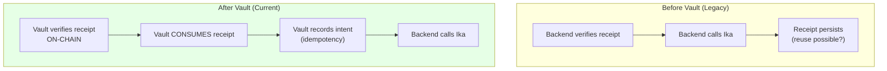
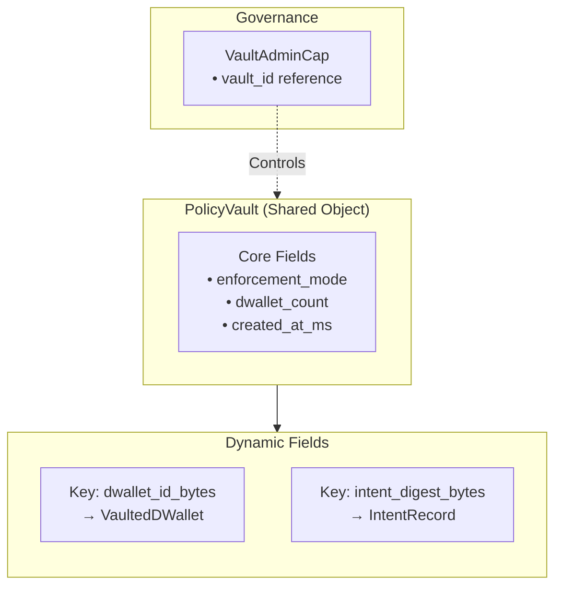
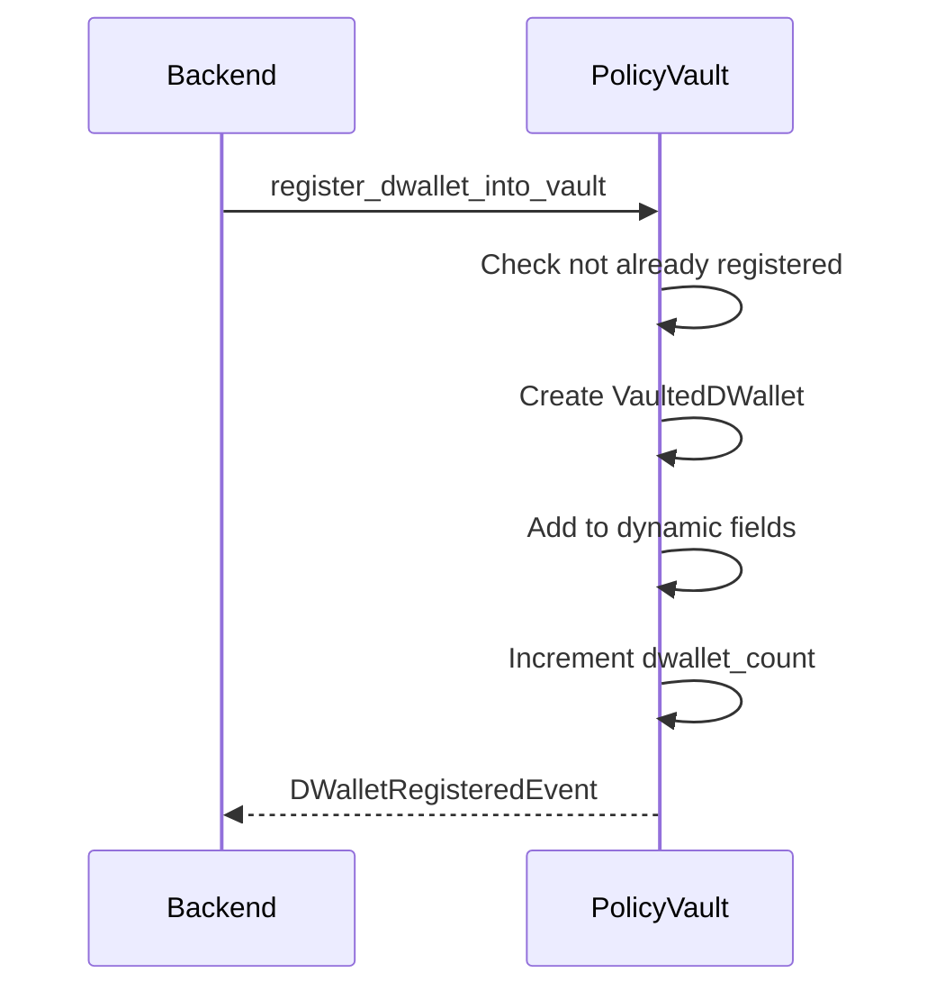
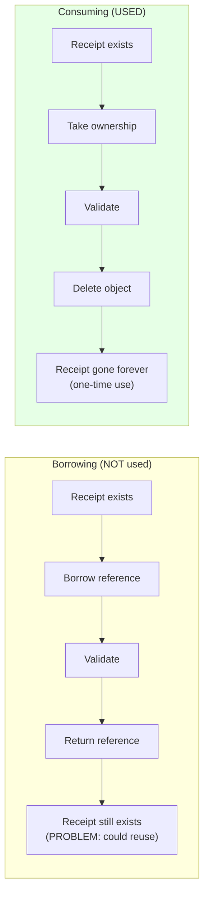
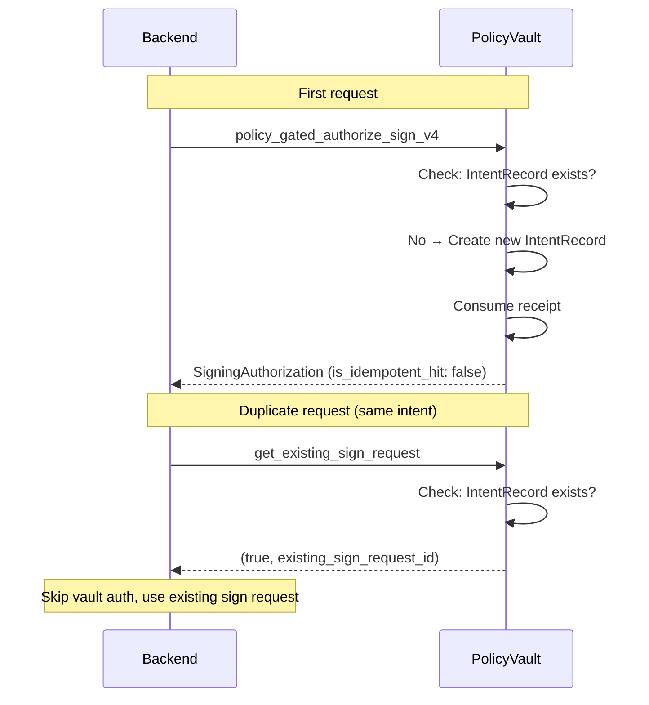
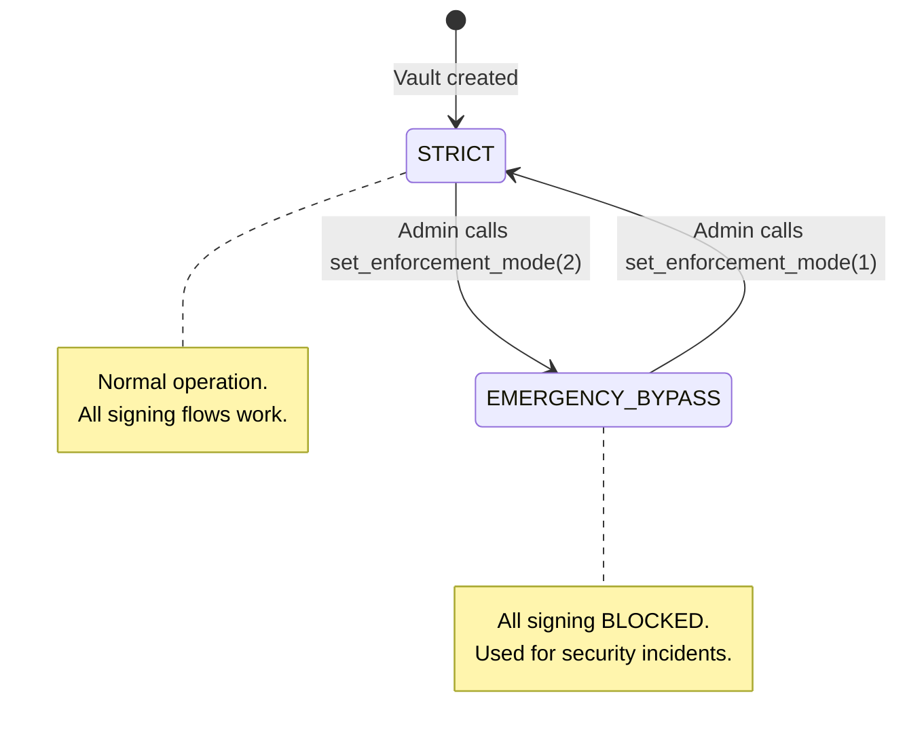

# PolicyVault

This document explains the PolicyVault, the mandatory on-chain enforcement gate for all Kairo signing operations.

---

## Why the Vault Exists

The PolicyVault implements **Option A** from Kairo's policy integration plan: all signing operations must be authorized through the vault. This provides:

1. **On-chain enforcement**: Policy checks happen in Move, not just backend code
2. **Receipt consumption**: One-time authorization prevents replay attacks
3. **Idempotency**: Same intent digest returns existing sign request
4. **Auditability**: Every authorization emits events for monitoring
5. **Emergency control**: Circuit breaker can disable signing system-wide



---

## Vault Architecture

### Storage Model

The vault uses Sui's dynamic fields to store per-dWallet and per-intent data:



### Core Structs

```move
/// Shared vault object
public struct PolicyVault has key {
    id: UID,
    enforcement_mode: u8,      // STRICT or EMERGENCY_BYPASS
    dwallet_count: u64,
    created_at_ms: u64,
}

/// Admin capability for governance
public struct VaultAdminCap has key, store {
    id: UID,
    vault_id: ID,
}

/// Stored per-dWallet (dynamic field)
public struct VaultedDWallet has store {
    dwallet_id: vector<u8>,
    binding_id: ID,
    stable_id: vector<u8>,
    registered_at_ms: u64,
    is_imported_key: bool,
}

/// Stored per-intent for idempotency (dynamic field)
public struct IntentRecord has store {
    intent_digest: vector<u8>,      // 32 bytes
    sign_request_id: ID,
    receipt_id: ID,
    binding_version_id: ID,
    recorded_at_ms: u64,
}
```

---

## Key Entrypoints

### 1. `create_and_share_vault`

Creates a new shared PolicyVault and transfers the admin cap to the sender.

```move
public fun create_and_share_vault(
    clock: &Clock,
    ctx: &mut TxContext
): ID
```

**Emits**: None (vault created)

**Returns**: Vault object ID

### 2. `register_dwallet_into_vault`

Registers a dWallet for vault-gated signing. Must be called before any signing attempts.

```move
public fun register_dwallet_into_vault(
    vault: &mut PolicyVault,
    clock: &Clock,
    dwallet_id: vector<u8>,
    binding_id: ID,
    stable_id: vector<u8>,
    is_imported_key: bool,
    ctx: &mut TxContext
)
```

**Checks**:
- dWallet not already registered (`E_DWALLET_ALREADY_REGISTERED`)

**Emits**: `DWalletRegisteredEvent`



### 3. `policy_gated_authorize_sign_v4`

The main authorization gate. Validates receipt, consumes it, and records the intent.

```move
public fun policy_gated_authorize_sign_v4(
    vault: &mut PolicyVault,
    receipt: PolicyReceiptV4,           // Consumed!
    binding: &PolicyBinding,
    clock: &Clock,
    dwallet_id: vector<u8>,
    intent_digest: vector<u8>,          // 32 bytes
    namespace: u8,
    chain_id: vector<u8>,
    destination: vector<u8>,
    receipt_ttl_ms: u64,                // 0 = no expiry check
    ctx: &mut TxContext
): SigningAuthorization
```

**Checks** (in order):

| # | Check | Error |
|---|-------|-------|
| 1 | enforcement_mode == STRICT | `E_VAULT_EMERGENCY_BYPASS` |
| 2 | intent_digest.length == 32 | `E_BAD_INTENT_DIGEST_LEN` |
| 3 | dWallet exists in vault | `E_DWALLET_NOT_FOUND` |
| 4 | receipt.allowed == true | `E_RECEIPT_NOT_ALLOWED` |
| 5 | receipt.intent_hash == intent_digest | `E_INTENT_HASH_MISMATCH` |
| 6 | receipt.destination == destination | `E_DESTINATION_MISMATCH` |
| 7 | receipt.chain_id == chain_id | `E_CHAIN_ID_MISMATCH` |
| 8 | receipt.namespace == namespace | `E_NAMESPACE_MISMATCH` |
| 9 | binding.active_version_id == receipt.policy_version_id | `E_BINDING_VERSION_MISMATCH` |
| 10 | binding.stable_id == receipt.policy_stable_id | `E_BINDING_STABLE_ID_MISMATCH` |
| 11 | vaulted.binding_id == binding.id | `E_BINDING_DWALLET_MISMATCH` |
| 12 | (if TTL) now <= receipt.minted_at_ms + ttl | `E_RECEIPT_EXPIRED` |

**Actions**:
1. Consume receipt (delete object)
2. Record IntentRecord (if new intent)
3. Emit `VaultSigningEvent`

**Returns**: `SigningAuthorization` (droppable struct with authorization details)

```mermaid
flowchart TB
    Start["policy_gated_authorize_sign_v4"] --> CheckMode{Enforcement<br/>mode?}
    CheckMode -->|"EMERGENCY_BYPASS"| Reject1["E_VAULT_EMERGENCY_BYPASS"]
    CheckMode -->|"STRICT"| CheckDigest{Intent digest<br/>32 bytes?}
    
    CheckDigest -->|No| Reject2["E_BAD_INTENT_DIGEST_LEN"]
    CheckDigest -->|Yes| CheckDWallet{dWallet in<br/>vault?}
    
    CheckDWallet -->|No| Reject3["E_DWALLET_NOT_FOUND"]
    CheckDWallet -->|Yes| CheckAllowed{Receipt<br/>allowed?}
    
    CheckAllowed -->|No| Reject4["E_RECEIPT_NOT_ALLOWED"]
    CheckAllowed -->|Yes| CheckFields["Check all fields match"]
    
    CheckFields --> CheckBinding["Check binding matches"]
    CheckBinding --> CheckTTL{TTL check<br/>(if enabled)}
    
    CheckTTL -->|Expired| Reject5["E_RECEIPT_EXPIRED"]
    CheckTTL -->|Valid| Consume["Consume receipt"]
    
    Consume --> Record["Record IntentRecord"]
    Record --> Emit["Emit VaultSigningEvent"]
    Emit --> Return["Return SigningAuthorization"]
```

### 4. `record_sign_request_id`

Updates an existing IntentRecord with the sign request ID from Ika. Called after signing completes.

```move
public fun record_sign_request_id(
    vault: &mut PolicyVault,
    intent_digest: vector<u8>,
    sign_request_id: ID,
    clock: &Clock
)
```

### 5. `get_existing_sign_request`

Checks if an intent has already been processed (idempotency lookup).

```move
public fun get_existing_sign_request(
    vault: &PolicyVault,
    intent_digest: &vector<u8>
): (bool, ID)  // (exists, sign_request_id)
```

### 6. `set_enforcement_mode`

Admin-only function to change vault enforcement mode.

```move
public fun set_enforcement_mode(
    vault: &mut PolicyVault,
    admin_cap: &VaultAdminCap,
    new_mode: u8,
    clock: &Clock
)
```

**Emits**: `VaultModeChangedEvent`

---

## Receipt Consumption vs Borrowing

The vault **consumes** receipts rather than just borrowing them:



The `consume_receipt_v4` function:

```move
public fun consume_receipt_v4(receipt: PolicyReceiptV4): object::ID {
    let receipt_id = object::id(&receipt);
    let PolicyReceiptV4 { id: receipt_uid, ... } = receipt;
    object::delete(receipt_uid);
    receipt_id
}
```

---

## Idempotency

The vault provides idempotency to handle retries and duplicate requests:



### Intent Digest Computation

The intent digest must match what's stored in the receipt:

```typescript
// Backend computation (vault-service.ts)
const intentHashHex = keccak256(messageBytes);
const intentDigest = new Uint8Array(Buffer.from(intentHashHex.replace(/^0x/, ""), "hex"));
```

**Critical**: The intent digest is `keccak256(message_bytes)`, NOT a wrapped format.

---

## Emergency Override / Circuit Breaker

The vault supports an emergency bypass mode:

| Mode | Value | Behavior |
|------|-------|----------|
| `ENFORCEMENT_STRICT` | 1 | Normal operation |
| `ENFORCEMENT_EMERGENCY_BYPASS` | 2 | All signing requests rejected |



### When to Use Emergency Bypass

- Suspected key compromise
- Policy vulnerability discovered
- System-wide security incident
- Coordinated maintenance

---

## Events

### VaultSigningEvent

Emitted for every signing authorization attempt:

```move
public struct VaultSigningEvent has copy, drop {
    vault_id: ID,
    intent_digest: vector<u8>,
    receipt_id: ID,
    binding_version_id: ID,
    sign_request_id: ID,
    enforcement_mode: u8,
    namespace: u8,
    chain_id: vector<u8>,
    destination: vector<u8>,
    is_idempotent_hit: bool,
    timestamp_ms: u64,
}
```

### DWalletRegisteredEvent

Emitted when a dWallet is registered:

```move
public struct DWalletRegisteredEvent has copy, drop {
    vault_id: ID,
    dwallet_id: vector<u8>,
    binding_id: ID,
    stable_id: vector<u8>,
    is_imported_key: bool,
    timestamp_ms: u64,
}
```

### VaultModeChangedEvent

Emitted when enforcement mode changes:

```move
public struct VaultModeChangedEvent has copy, drop {
    vault_id: ID,
    old_mode: u8,
    new_mode: u8,
    timestamp_ms: u64,
}
```

---

## Error Codes

| Code | Constant | Description |
|------|----------|-------------|
| 1 | `E_RECEIPT_NOT_ALLOWED` | Receipt has allowed=false |
| 2 | `E_INTENT_HASH_MISMATCH` | Intent hash doesn't match |
| 3 | `E_DESTINATION_MISMATCH` | Destination doesn't match |
| 4 | `E_CHAIN_ID_MISMATCH` | Chain ID doesn't match |
| 5 | `E_NAMESPACE_MISMATCH` | Namespace doesn't match |
| 6 | `E_BINDING_VERSION_MISMATCH` | Binding version != receipt version |
| 7 | `E_BINDING_STABLE_ID_MISMATCH` | Binding stable ID != receipt stable ID |
| 8 | `E_BINDING_DWALLET_MISMATCH` | Binding not for this vaulted dWallet |
| 9 | `E_DWALLET_NOT_FOUND` | dWallet not registered in vault |
| 10 | `E_NOT_ADMIN` | Caller not vault admin |
| 11 | `E_VAULT_EMERGENCY_BYPASS` | Vault in emergency mode |
| 12 | `E_RECEIPT_EXPIRED` | Receipt TTL exceeded |
| 13 | `E_BAD_INTENT_DIGEST_LEN` | Intent digest not 32 bytes |
| 14 | `E_DWALLET_ALREADY_REGISTERED` | dWallet already in vault |
| 15 | `E_INVALID_SIGNING_TICKET` | Invalid signing ticket |

---

## Backend Integration

### VaultService (TypeScript)

The backend's `VaultService` wraps vault interactions:

```typescript
class VaultService {
  // Get configured vault object ID
  getVaultObjectId(): string

  // Add vault authorization to a transaction
  async authorizeVaultSigning(tx: Transaction, params: VaultAuthorizeParams): Promise<any>

  // Check if intent already processed
  async getExistingSignRequest(vaultObjectId: string, intentDigest: Uint8Array): Promise<string | null>

  // Register dWallet in vault
  addRegisterDWalletIntoVault(tx: Transaction, params: {...}): void
}
```

### SignService Integration

The `SignService` requires vault params for all signing:

```typescript
// sign-service.ts
async sign(params: {
  // ... other params
  vaultParams: VaultSigningParams;  // REQUIRED - no legacy path
}): Promise<SignatureResult>
```

If `vaultParams` is not provided, signing fails with:

```
"vaultParams is required - all signing must go through the PolicyVault."
```

---

## Recovery (`complete_recovery`)

Entrypoint for recovery flows (implemented):

```move
public fun complete_recovery(
    vault: &mut PolicyVault,
    recovery_receipt: RecoveryReceiptV1,  // New receipt type
    binding: &PolicyBinding,
    clock: &Clock,
    ctx: &mut TxContext
)
```

This:
1. Validates recovery receipt (threshold approvals met, timelock passed)
2. Re-enables signing for the specified dWallet
3. Emits recovery completion event
