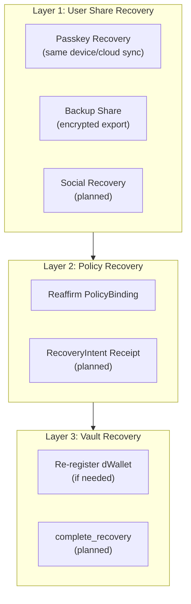
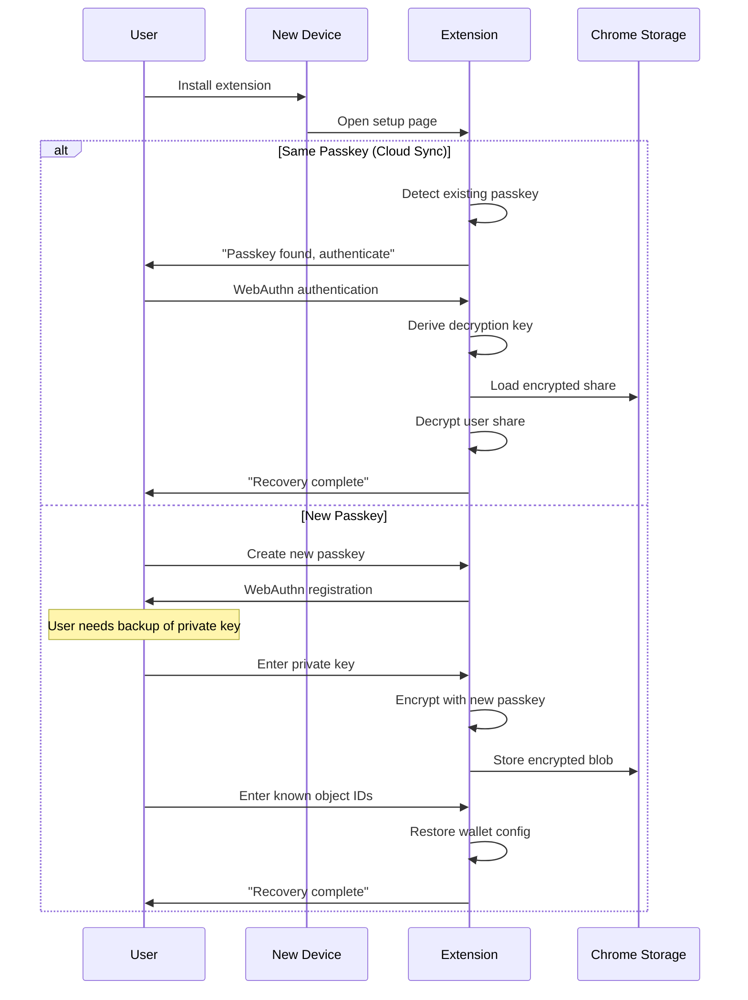
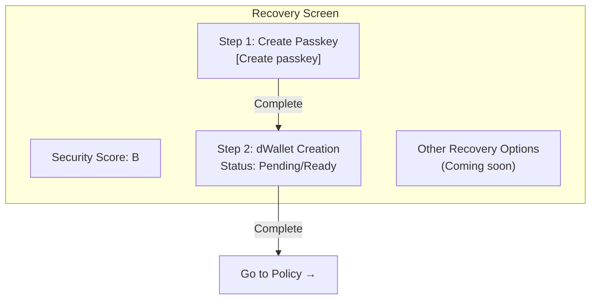
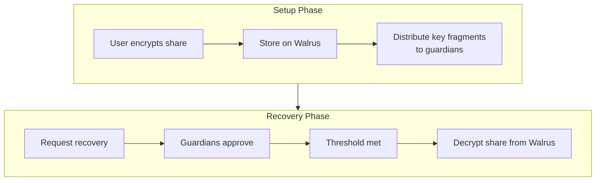
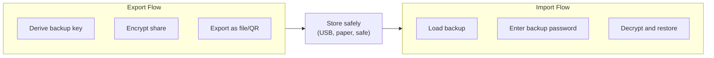
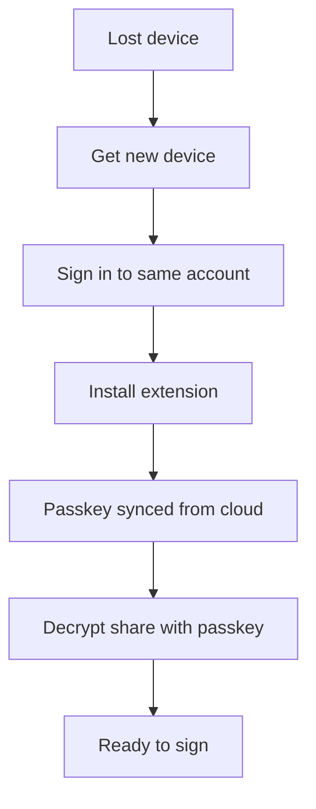
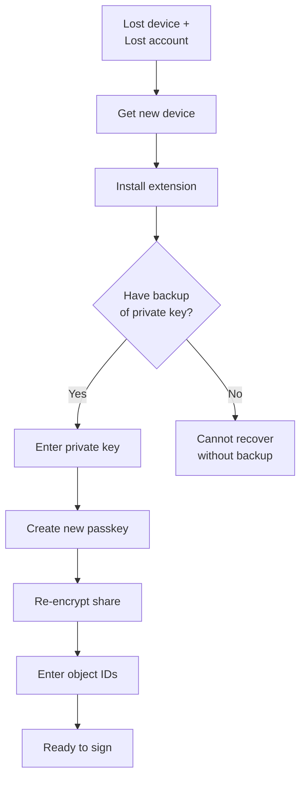
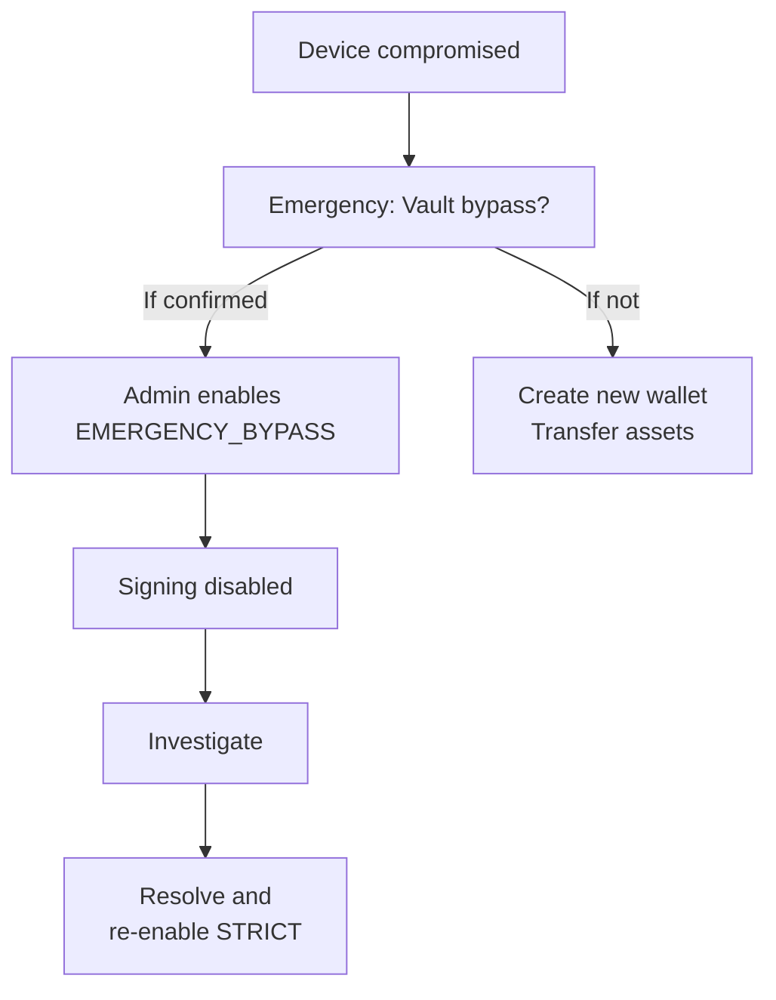
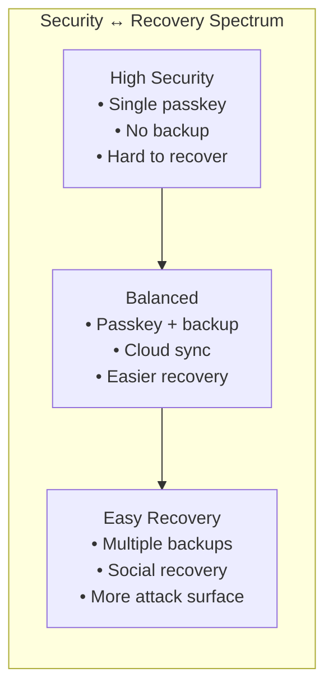

# Recovery

This document describes Kairo's recovery mechanisms for regaining access to signing capabilities after device loss, passkey loss, or other access issues.

---

## Recovery Overview

Kairo employs a layered recovery approach:



---

## Current Implementation

### Passkey-Based Recovery

The current code supports passkey-based recovery where the user either:
1. Uses the same passkey (synced via iCloud/Google)
2. Creates a new passkey and re-imports their private key



### Wallet State After Recovery

After recovery, the wallet state should be:

| Component | Status | Action Needed |
|-----------|--------|---------------|
| User Share | Restored | Encrypted with new/same passkey |
| dWallet | Exists | No action (on Ika network) |
| PolicyBinding | Exists | May need reaffirmation if policy updated |
| Vault Registration | Exists | No action (persists on Sui) |

---

## Recovery UI (Extension)

The extension's setup flow includes recovery-related screens:

```typescript
// setup/types.ts
export type SetupRoute =
  | "welcome"
  | "add-wallet"
  | "recovery"      // <-- Recovery screen
  | "protection"    // Legacy, redirects to recovery
  | "policy"
  | "dashboard"
  | "timeline"
  | "summary";
```

### Recovery Screen Features

The recovery screen (`renderRecovery` in `setup.ts`) shows:

1. **Security Score**: Based on enabled protections
2. **Step 1: Create Passkey**: If no passkey exists
3. **Step 2: dWallet Creation**: Status of dWallet
4. **Other Recovery Options**: Currently marked as "Coming soon"
   - Backup to Another Device
   - Encrypted Cloud Backup



---

## Planned Recovery Options

### 1. Social Recovery (Walrus + Seal)

**Status**: Partially implemented (on-chain guardian recovery is live; Walrus+Seal integration is planned)

A threshold-based social recovery system where:
- User designates trusted guardians
- Share is encrypted and stored on Walrus (decentralized storage)
- Guardians hold Seal committee keys
- Recovery requires M-of-N guardian approvals



### 2. Backup Secret / Cold Storage

**Status**: Planned/TBD

Export an encrypted backup that can be stored offline:



### 3. RecoveryIntent Receipt

**Status**: Implemented

A policy-level recovery mechanism using special receipts:

```move
public struct RecoveryReceiptV1 has key, store {
    id: UID,
    dwallet_id: vector<u8>,
    stable_id: vector<u8>,
    recovery_type: u8,           // Type of recovery
    approvals: vector<Approval>,  // Guardian approvals
    timelock_start_ms: u64,      // When timelock started
    timelock_duration_ms: u64,   // Required wait time
    minted_at_ms: u64,
}
```

### 4. Vault Re-authorization

**Status**: Implemented

A vault entrypoint for completing recovery:

```move
public fun complete_recovery(
    vault: &mut PolicyVault,
    recovery_receipt: RecoveryReceiptV1,
    binding: &PolicyBinding,
    clock: &Clock,
    ctx: &mut TxContext
) {
    // 1. Validate recovery receipt
    // 2. Check timelock has passed
    // 3. Verify threshold approvals
    // 4. Re-enable signing for dWallet
    // 5. Emit recovery event
}
```

---

## Recovery Scenarios

### Scenario 1: Lost Device, Same Account

**Situation**: User lost phone but has iCloud/Google account with passkey sync.



**Steps**:
1. Get new device
2. Sign in to same iCloud/Google account
3. Install Kairo extension
4. Passkey is synced automatically
5. Extension can decrypt stored share
6. Ready to use

### Scenario 2: Lost Device, New Account

**Situation**: User lost device and cannot access old cloud account.



**Steps**:
1. Get new device with new account
2. Install extension
3. Create new passkey
4. Import private key from backup
5. Enter known object IDs (dWallet, binding, policy)
6. Ready to use

### Scenario 3: Compromised Device

**Situation**: User suspects device was compromised.



**Steps**:
1. If compromise confirmed, consider vault emergency bypass
2. Investigate extent of compromise
3. Create new wallet with new policy if needed
4. Transfer assets to new wallet
5. Revoke old policy binding

---

## Recovery Checklist

### What Users Should Back Up

| Item | How to Backup | Recovery Priority |
|------|---------------|-------------------|
| Private Key | Write down / encrypted file | **Critical** |
| dWallet Object ID | Note in password manager | High |
| Policy Object ID | Note in password manager | Medium |
| Binding Object ID | Note in password manager | Medium |
| Passkey | Cloud sync (automatic) | High |

### What Persists On-Chain

| Object | Location | Persistence |
|--------|----------|-------------|
| dWallet | Ika network | Permanent |
| PolicyBinding | Sui | Permanent |
| Policy | Sui | Permanent |
| Vault Registration | Sui | Permanent |
| CustodyEvents | Sui | Permanent |

### What's Stored Locally

| Item | Location | Recovery |
|------|----------|----------|
| Encrypted share | Chrome storage | Re-import key |
| Passkey credential | OS keychain | Cloud sync |
| Wallet config | Chrome storage | Re-enter IDs |

---

## Security Considerations

### Recovery vs Security Tradeoffs



### Recommendations

| User Type | Recommended Setup |
|-----------|-------------------|
| High-value assets | Passkey + encrypted cold backup |
| Regular use | Passkey with cloud sync |
| Testing | Any convenient method |

---

## Code References

| Component | Location |
|-----------|----------|
| Recovery UI | `external/key-spring/browser-extension/src/setup.ts` (renderRecovery) |
| Wallet state types | `external/key-spring/browser-extension/src/setup/types.ts` |
| State persistence | `external/key-spring/browser-extension/src/setup/state.ts` |
| Passkey crypto | `external/key-spring/browser-extension/src/crypto.ts` |
