# Security

This document describes Kairo's threat model, security properties, and risk mitigations.

---

## Security Architecture

Kairo's security is built on multiple layers of protection:

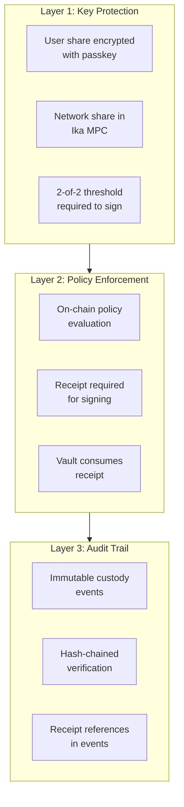

---

## Trust Boundaries

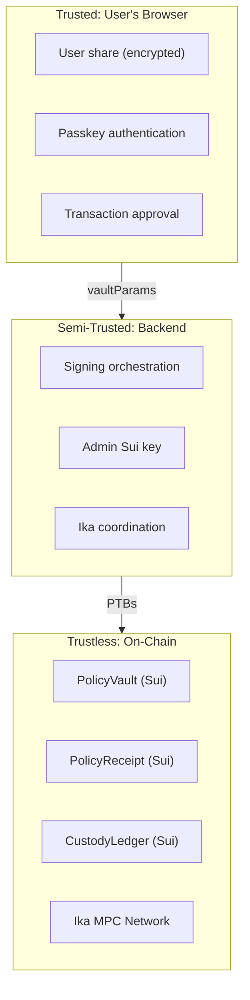

### Trust Assumptions

| Component | Trust Level | Assumption |
|-----------|-------------|------------|
| User's device | Fully trusted | Not compromised |
| User's passkey | Fully trusted | User controls it |
| Backend | Semi-trusted | Follows protocol, but verify on-chain |
| Sui network | Trustless | Byzantine fault tolerant |
| Ika MPC | Trustless | Threshold security (t-of-n) |
| Move modules | Trustless | Code is law (auditable) |

---

## Threat Analysis

### Threat 1: Key Loss

**Scenario**: User loses access to their private key share.

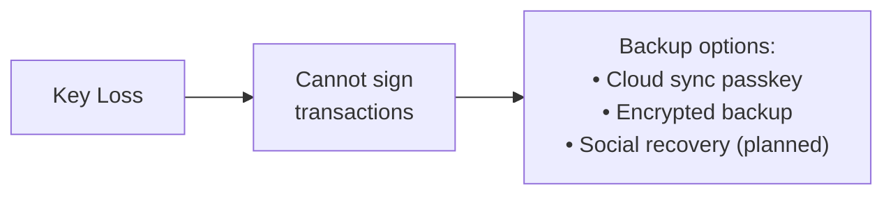

| Aspect | Detail |
|--------|--------|
| **Likelihood** | Medium (device loss, account lockout) |
| **Impact** | High (funds inaccessible) |
| **Mitigation** | Multiple backup options |
| **Residual Risk** | User must actually create backups |

### Threat 2: Device Compromise

**Scenario**: Attacker gains access to user's device with extension.

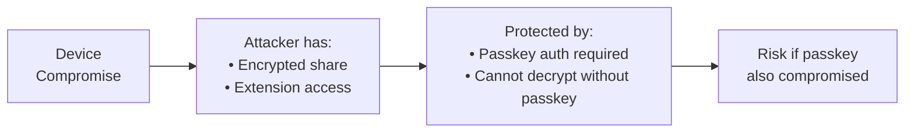

| Aspect | Detail |
|--------|--------|
| **Likelihood** | Low-Medium |
| **Impact** | High if passkey also compromised |
| **Mitigation** | Passkey encryption, biometric auth |
| **Residual Risk** | Full device + passkey compromise |

### Threat 3: Phishing / Malicious dApp

**Scenario**: User tricked into approving malicious transaction.

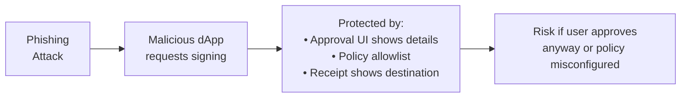

| Aspect | Detail |
|--------|--------|
| **Likelihood** | Medium (common attack vector) |
| **Impact** | Variable (depends on policy) |
| **Mitigation** | Clear approval UI, policy allowlists |
| **Residual Risk** | User approves despite warnings |

### Threat 4: Backend Compromise

**Scenario**: Attacker compromises the backend server.

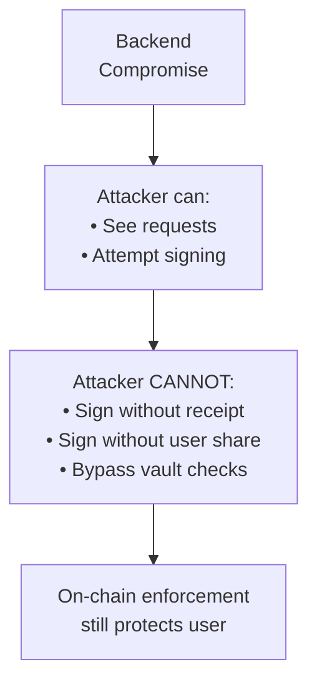

| Aspect | Detail |
|--------|--------|
| **Likelihood** | Low (requires server access) |
| **Impact** | Limited by on-chain checks |
| **Mitigation** | Vault enforcement, receipt requirement |
| **Residual Risk** | Admin key misuse for receipt minting |

### Threat 5: Replay Attack

**Scenario**: Attacker tries to reuse an old receipt or repeat a signing.

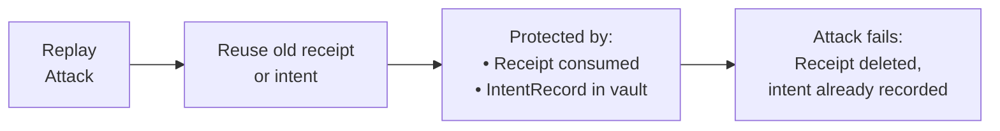

| Aspect | Detail |
|--------|--------|
| **Likelihood** | Low (requires receipt access) |
| **Impact** | None (attack prevented) |
| **Mitigation** | Receipt consumption, idempotency |
| **Residual Risk** | None (cryptographically prevented) |

---

## Security Properties

### Property 1: Non-Custodial

The user's secret share is **never** sent to any server:

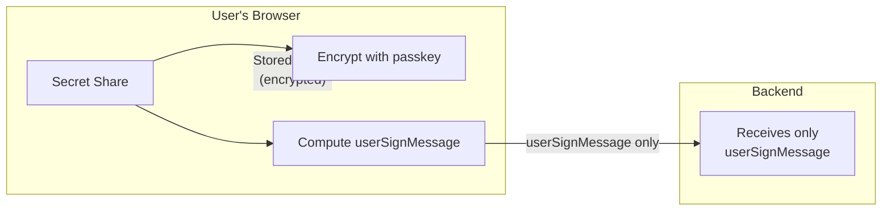

### Property 2: Policy Enforcement On-Chain

All policy checks happen in Move code on Sui:

```move
// Vault checks in dwallet_policy_vault.move
assert!(receipt_v3_is_allowed(&receipt), E_RECEIPT_NOT_ALLOWED);
assert!(u8_vec_equal(&receipt_intent, &intent_digest), E_INTENT_HASH_MISMATCH);
assert!(u8_vec_equal(&receipt_dest, &destination), E_DESTINATION_MISMATCH);
// ... 9 total checks
```

### Property 3: One-Time Authorization

Each receipt can only be used once:

```move
public fun consume_receipt_v3(receipt: PolicyReceiptV3): object::ID {
    let receipt_id = object::id(&receipt);
    // Destructure and DELETE the receipt
    let PolicyReceiptV3 { id: receipt_uid, ... } = receipt;
    object::delete(receipt_uid);
    receipt_id
}
```

### Property 4: Idempotency Protection

Same intent cannot be signed twice:

```move
// In policy_gated_authorize_sign_v3
let is_idempotent_hit = dynamic_field::exists_(&vault.id, intent_digest);
if (!is_idempotent_hit) {
    // First time: create record
    dynamic_field::add(&mut vault.id, intent_digest, record);
}
// Second time: record already exists, will return existing sign request
```

### Property 5: Verifiable Audit Trail

Every signing action creates immutable proof:

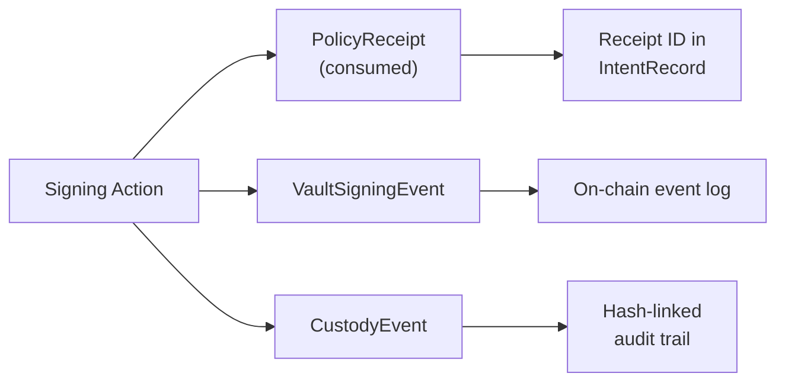

---

## What Kairo Does NOT Protect Against

| Scenario | Why Not Protected | Mitigation |
|----------|-------------------|------------|
| Compromised user device + passkey | Full client compromise | Physical security |
| User approves malicious tx | User chose to approve | Education, clear UI |
| Policy misconfiguration | Policy allows bad action | Careful policy setup |
| Ika network compromise | Threshold assumption | Ika's security model |
| Sui consensus failure | Network-level | Sui's BFT security |
| Zero-day in Move VM | Platform vulnerability | Sui team fixes |

---

## Vault and Policy Mitigations

### How Vault Mitigates Risk

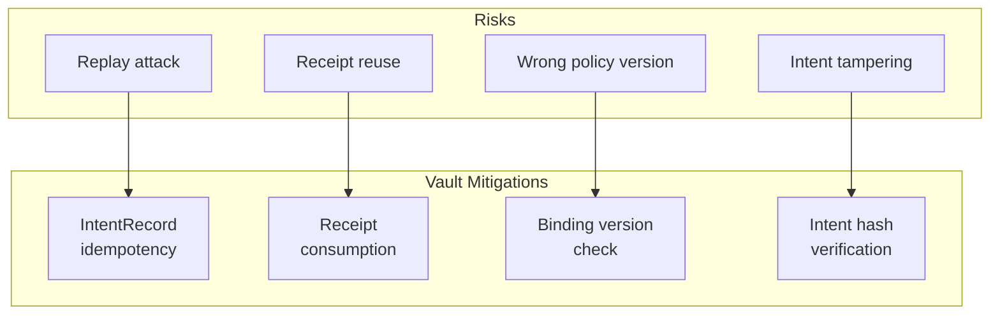

### How Policies Mitigate Risk

| Policy Feature | Risk Mitigated |
|----------------|----------------|
| Destination allowlist | Unauthorized recipients |
| Selector denylist | Dangerous contract calls |
| ERC20 amount limits | Large unauthorized transfers |
| Chain ID allowlist | Wrong network transactions |
| Fee rate limits (BTC) | Fee manipulation |
| Program allowlist (SOL) | Malicious program interaction |

---

## Emergency Procedures

### Circuit Breaker

The vault supports emergency bypass mode:

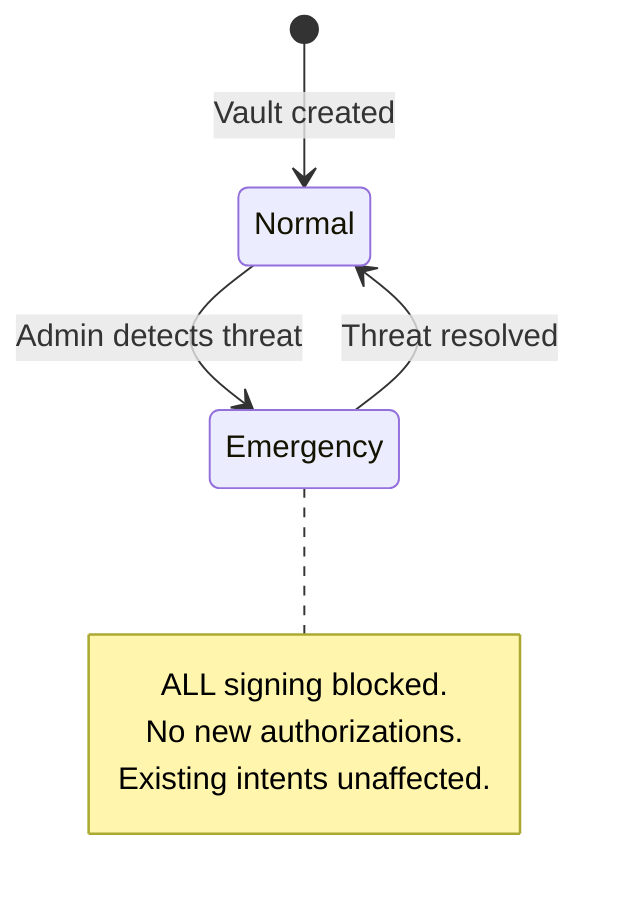

**When to use**:
- Suspected key compromise
- Policy vulnerability discovered
- Coordinated attack detected

**How to trigger**:
```move
set_enforcement_mode(vault, admin_cap, ENFORCEMENT_EMERGENCY_BYPASS, clock);
```

### Incident Response

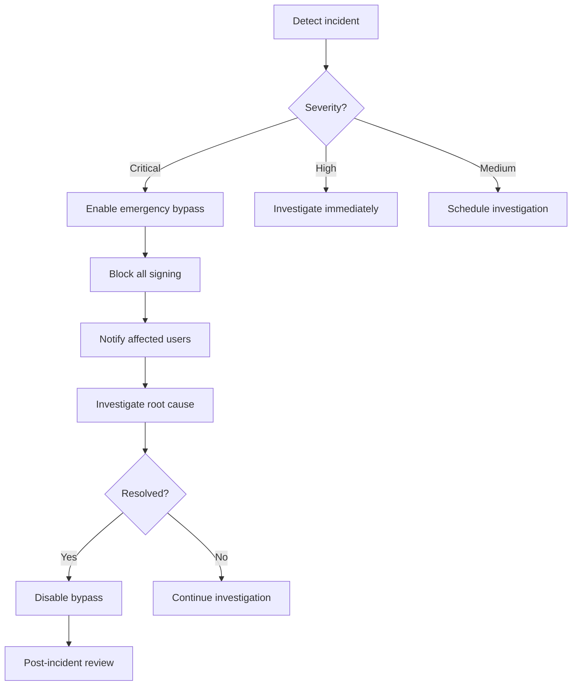

---

## Security Checklist

### For Users

- [ ] Create passkey with biometric auth
- [ ] Enable cloud sync for passkey (iCloud/Google)
- [ ] Back up private key securely
- [ ] Note dWallet and policy object IDs
- [ ] Review policy allowlists carefully
- [ ] Verify transaction details before approving

### For Operators

- [ ] Secure admin key with HSM or MPC
- [ ] Monitor vault events for anomalies
- [ ] Set up alerting for emergency bypass
- [ ] Regular security audits of Move code
- [ ] Keep backend dependencies updated
- [ ] Implement rate limiting on APIs

### For Developers

- [ ] Never log private keys or shares
- [ ] Validate all inputs before signing
- [ ] Use constant-time comparisons for secrets
- [ ] Handle errors without leaking info
- [ ] Test with malicious inputs
- [ ] Review vault error conditions

---

## Code References

| Security Feature | Location |
|------------------|----------|
| Passkey encryption | `external/key-spring/browser-extension/src/crypto.ts` |
| Vault checks | `sui/kairo_policy_engine/sources/dwallet_policy_vault.move` |
| Receipt consumption | `sui/kairo_policy_engine/sources/policy_registry.move` |
| Custody hashing | `sui/kairo_policy_engine/sources/custody_ledger.move` |
| Backend vaultParams | `external/key-spring/backend/src/services/sign-service.ts` |
